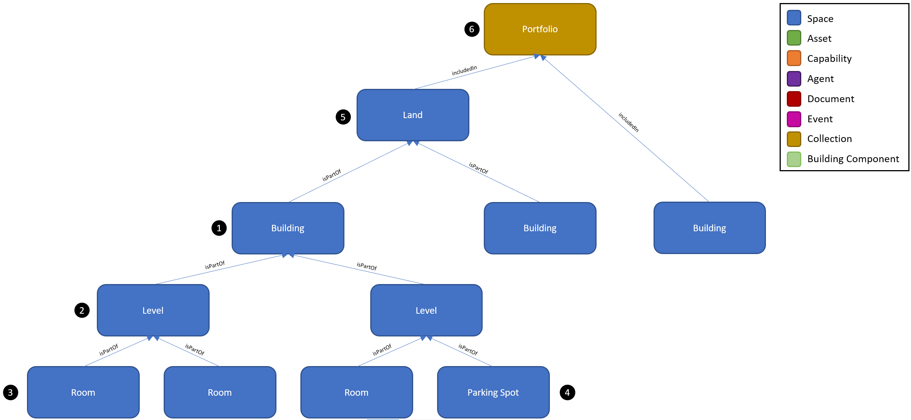
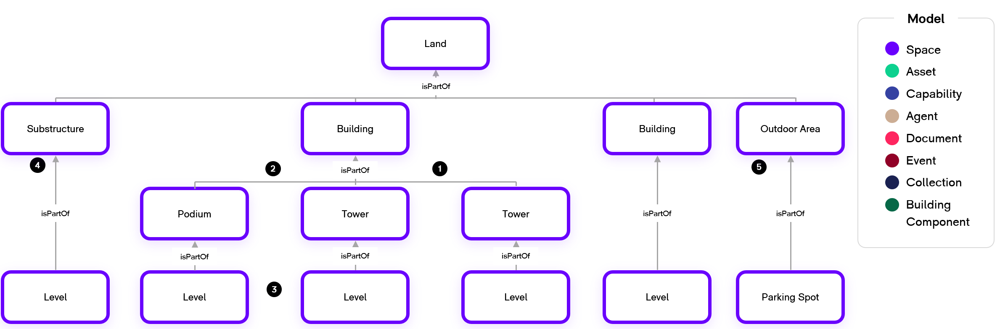
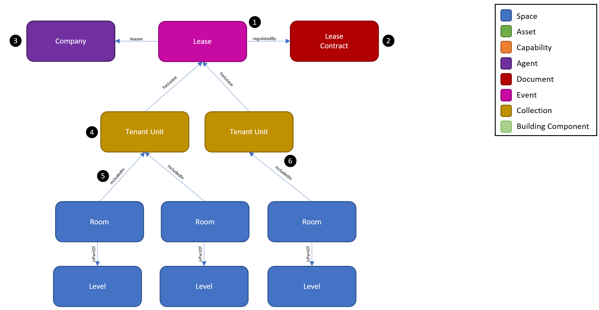
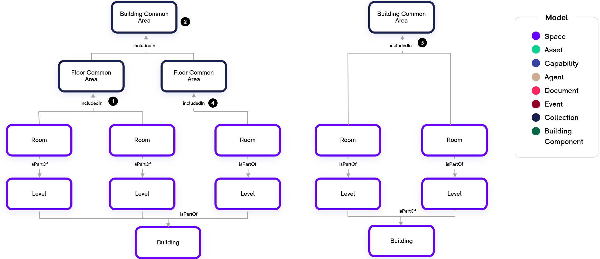

# Digital Twin Samples - Space

Space is one of the most prevalent entities and thus a fundamental concept to model with a digital twin. Many other models form relationships with space such as defining an asset’s location, how an asset serves a space, a lease for a tenant unit, or a portfolio of buildings. Almost every system or platform which the WillowTwin connects to also has a concept of space.

A Space is defined as a contiguous location in the physical world that has a 3D spatial extent and can contain sub-spaces or be apart of super-spaces to define a logical hierarchy. The following describes a common hierarchy amongst spatial twins:

## Spatial Hierarchy

### Simple Hierarchy

1. At the core of every spatial hierarchy is a Building. A Building is a type of space which generally has an address and a well-understood boundary based on its construction profile and registration as an entity with a local government.

2. Each Building has one or more Levels. These are vertical delineations within the building which may or may not be occupiable. The levels may be above or below ground and still considered part of the Building.

3. A Room is a type of space which is typically bounded by walls and part of the Level at which the floor of the Room is located. Rooms have codes and/or names assigned which give them a unique identity within the Building.

4. A Parking Spot is a space to park a vehicle and has a unique code. A Parking Spot can be assigned to a Level as shown in this example or a Room on a Level.

5. A Land is a contiguous space upon which one or more Buildings may be located. A Land typically has a well-defined outline that is projected as a 2D bounding box. Other terms for Land include site, campus, precinct, premises, or district.

6. A Portfolio is a Collection because it is not a contiguous location. Instead, a Portfolio can be used flexibly to define a group of Buildings and/or Lands that have commonality. A customer may have several Portfolios, and Buildings and Lands may belong to multiple Portfolios if the customer wants to create different groupings. For example, a Building may belong to the Acme Joint Venture portfolio as well as the Commercial Office portfolio. Additionally, a Portfolio may contain other Portfolios.

### Complex Hierarchy

Real estate often has more complex developments which can be accommodated by introducing additional concepts. The following describes a more complex Land which could be a campus or district:

1. A Building often has multiple Towers or Wings which each have their own identity even though the Building has a single postal address. Here we show two towers that are part of the Building.

2. A Podium is an above grade structure that forms the base of a Building. It often projects out from the Building’s Tower.

3. Each of the Towers and Podium in the Building contain Levels. Levels can only be part of structures such as a Building, Tower, Wing, Podium, or Substructure. Levels cannot directly be part of spaces which aren’t structures such as a Land, Outdoor Area, or Zone.

4. A substructure is a below grade structure used to support the Building superstructure but may also contain spaces used for parking or building services. The substructure is part of the Land because it may span more than the footprint of a single building and often provides services for the entire Land. It has its own Levels which are identified as a part of the substructure. When a Land has a single Building which has below grade levels that are identified as part of the Building, it is acceptable to directly have the Levels part of the Building just as the above grade levels are part of the Building.

5. A Land may also have distinct Outdoor Areas such as Plazas or Surface Parking Lots. This allows outdoor Assets such as lamp posts, fire hydrants, and benches or Spaces such as Parking Spots to be in an Outdoor Area.

## Leasing Space

Leasing includes scenarios where people or companies are leasing space from a landlord. The following describes a common scenario with commercial office leasing:

1. A Lease is defined as an Event because it has a defined start time and duration for which it is valid. The Lease event has many relationships to other types of twins as shown in this example and is essential to this use case.

2. The Lease contract is the actual document(s) which contain the Lease event legal terms. The Lease event is related to the Lease Contract using the regulatedBy relationship.

3. A Lease also has a leasee Company which is commonly referred to as the tenant company. Not shown in this example is another Lease relationship defining the lessor which is the company owning the asset and renting it to the leasee.

4. A Tenant Unit is a collection of Spaces which are being rented by the tenant company.

5. In this example, the Tenant Unit is a collection of one or more Rooms which is defined with the includedIn relationship. This is an important relationship because it is the means by which a Tenant Unit (and Lease) attach to spatial twins such as a Building via the Room and Level twins.

6. Notice that because the Tenant Unit is a Collection, that it cannot use the “isPartOf” relationship to attach directly to a Level. Therefore, in this example, at least one Room is always required for each Tenant Unit. The single Room includedIn this Tenant Unit may encompass the entire Tenant Unit and be named the same as the Tenant Unit. For example, the Tenant Unit may be named “Suite 1400 – Acme Enterprises” and the Room may also be named “Suite 1400 – Acme Enterprises” and isPartOf Level 14.

## Operating Space

Buildings often have the need to define areas by how they are operated, maintained, or provided service.

### Common Areas

In this example, we show how to define Building Common Areas and Floor Common Areas:

1. A Floor Common Area is a collection of Rooms which is shared by all tenants or occupants on that floor such as corridors, lobbies, and restrooms. In multi-tenant buildings, the landlord maintains and operates the area. In some jurisdictions, the tenants are responsible for paying rent on a pro-rata portion of this area which can also include areas that are not accessible to them such as janitor closets, HVAC rooms, and electrical rooms. The Floor Common Area includes all of the Rooms on a Level which aren’t part of a Tenant Unit.

2. A Building Common Area is a collection of Rooms which is shared by all tenants or occupants of the entire Building. When Floor Common Areas are defined, it is the collection of all Floor Common Areas. There can only be a single Building Common Area twin per Building as this is intended to capture the entirety of space which is not leased by tenants which is sometimes also referred to as the base building.

3. When Floor Common Areas are not defined for a Building, the Building Common Area includes all Rooms across all Levels which are considered common, shared, or base building.

4. Notice that because the Floor and Building Common Areas are Collections (similar to Tenant Unit), that they cannot use the “isPartOf” relationship to attach directly to a Level. Therefore, in this example, at least one Room is always required for each Floor or Building Common Area. When specific Rooms are unknown, the single Room includedIn this Floor Common Area may encompass the entire Floor Common Area and be named the same as the Floor Common Area. For example, the Common Area may be named “Level 14 – Base Building Area” and the Room may also be named “Level 14 – Base Building Area” and isPartOf Level 14.
