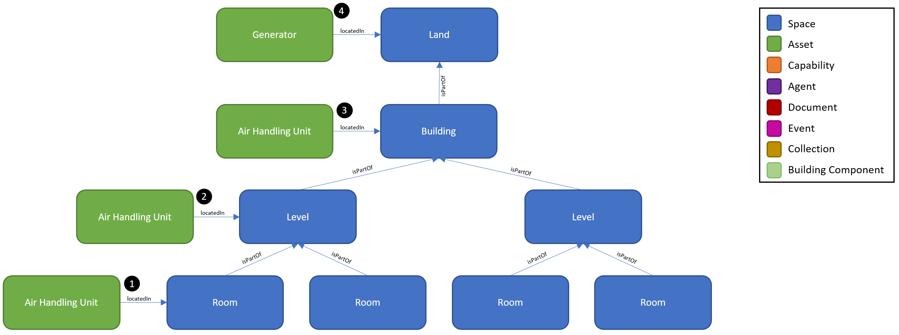
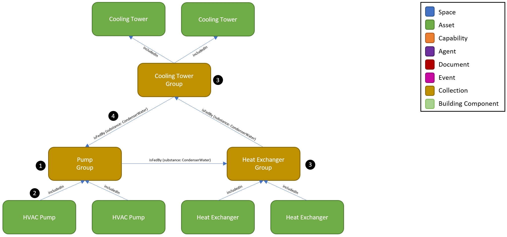
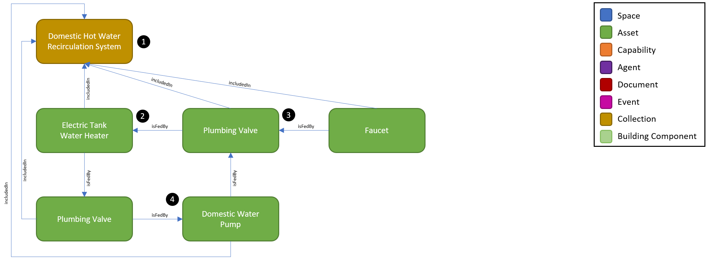

# Digital Twin Samples - Assets

Assets are one of the most prevalent entities and thus a fundamental concept to model with a digital twin. Many other models form relationships with assets such as defining an asset’s location or a space it serves; assigning an asset’s capabilities such as sensors, actuators or states; and grouping assets into equipment groups and systems.

An Asset is defined as a physical object which generally has a manufacturer, model number, and serial number. There are three primary types of assets from which all others derive from: Architectural, Equipment, and Furniture.

## Asset Locations

1. In this example, the Air Handling Unit is locatedIn a Room. A Room is the most atomic type of space within a Building. It is the best type of Space to define an asset’s location because it the most specific and all parent spaces such as Level and Building can be inferred through a query. This is typically achieved when an Asset twin is sourced from a BIM file.

2. When a Room is unknown, the next best option is to locate an Asset on a Level. This will enable the Asset to be searchable from a floor-specific user interface in the WillowTwin.

3. When a Level is unknown, the last option is locating as Asset in a Building. This may be the case when the Air Handling Unit is discovered by connecting to a BMS and no spatial context is known. By attaching the asset to the Building, Level, or Room, it enables the Air Handling Unit to be queried and searched within the Building.

4. Not all assets may be physically located within a Building. In this example, the Generator is located on the premises outside the Building, so it is locatedIn the Land which the Building sits on.

## Asset Groups

Asset Groups are a means of giving identity to a collection of common assets which are performing a joint operational task or being managed as a single entity. This concept is both powerful and flexible in how to more accurately describe the real world where traditional relational database schemas fall short.

 1. The Pump Group is a collection of two pumps which are working together and have a shared controller (not shown). This is a very common scenario where pumps are operating in parallel with common piping or pumps are deployed with redundancy such that only a single pump is required to carry the process load.

2. Because Asset Groups are Collections, the Pump assets use the includedIn relationship in this example.

3. Similar to the Pump Group, this example shows a Cooling Tower Group and Heat Exchanger Group. Asset and Equipment groups are defined by their underlying asset type. If there is a desire to group assets of different types, this should be considered a System.

4. Just as Assets can feed other Assets using the isFedBy relationship, so too can Asset Groups. In this example, the Cooling Tower Group is feeding Condenser Water to the Pump Group. This is very common when a common pipe feeds multiple assets in parallel. The isFedBy relationship can be thought of as the physical piping. Just as twins can have Properties, so too can relationships. In this example, the isFedBy relationship defines the substance Condenser Water which is being fed. The full list of substances can be found on the REC Equipment definition. It is recommended to be as specific as possible when defining the substance such as using Condenser Water instead of Water.

## Systems

Systems are another means of giving identity to a collection of assets which are performing a joint operational task or being managed as a single entity. Systems can be comprised of many different types of assets whereas Asset Groups are a collection of the same type of asset. Common Systems in a building include HVAC Chilled Water System, HVAC Supply Air System, Plumbing Domestic Water System, Fire Protection Sprinkler System, AC Electrical System, and ICT Ethernet Network System.

 1. The Domestic Hot Water Recirculation System is a plumbing system which includes several equipment types for the purpose of circulating hot water to various plumbing fixtures such as Faucets to make hot water readily available. In this example, the Domestic Hot Water System collection includes 5 assets and a loop of water as described below. Because most water distribution systems includes loops of water with widely varying configurations, the graph database is easily able to depict the loops with flexible relationships whereas a relational database would be challenged due to its rigid structure.

2. Hot Water is generated in the Electric Tank Water Heater, so it is generally considered the starting point for a domestic hot water distribution system. The water heater itself is connected to several systems including an incoming Cold Domestic Water feed and an AC Electrical system to power the heating element.

3. The water heater feeds water to a Plumbing Valve which can be used to shut-off or isolate water downstream in case maintenance needs to be performed on the Faucet. In normal operations, the valve is open and sends water to the Faucet.

4. The Plumbing Valve #3 also sends the water to the Domestic Water Pump which is performing the work of circulating the water back to the water heater via another Plumbing Valve.
