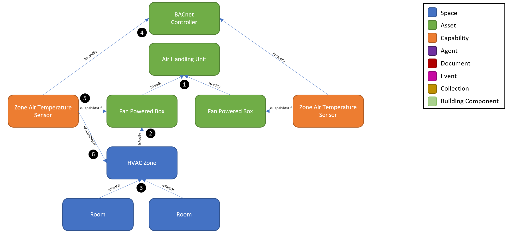
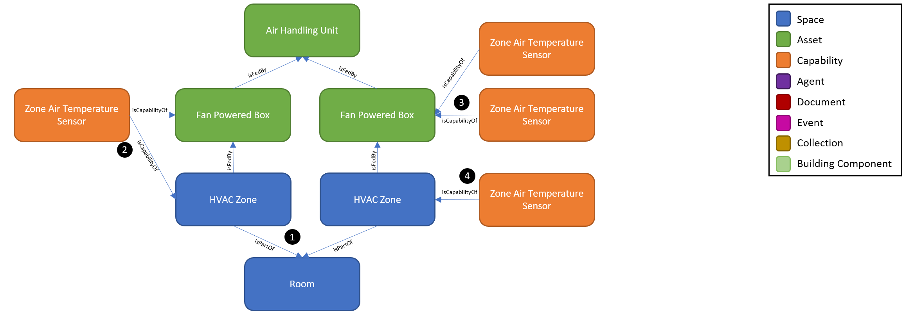
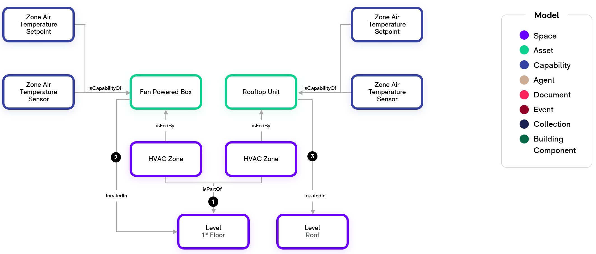
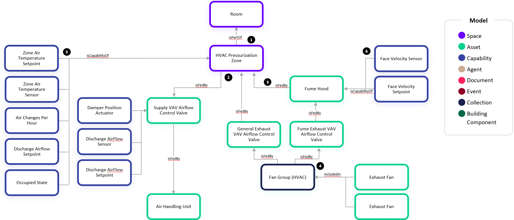
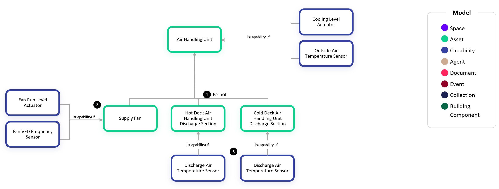
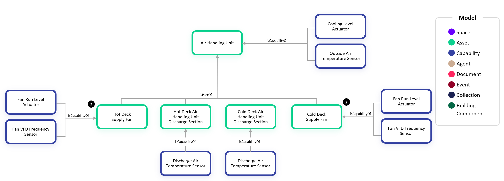
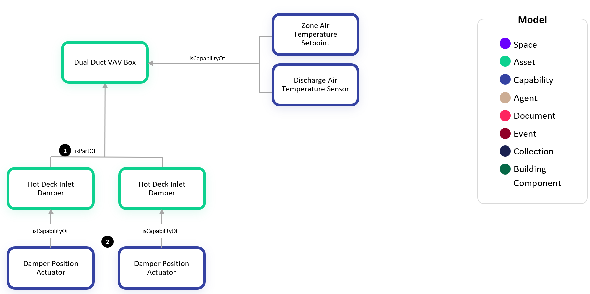
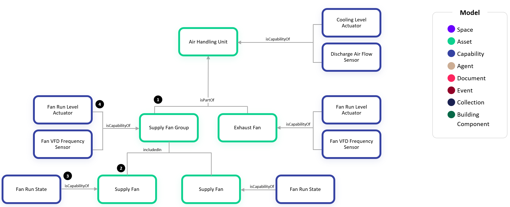
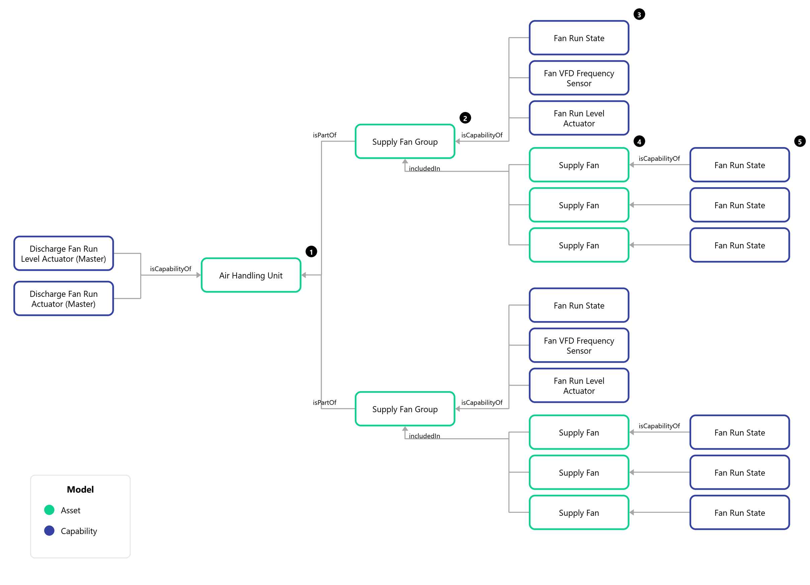
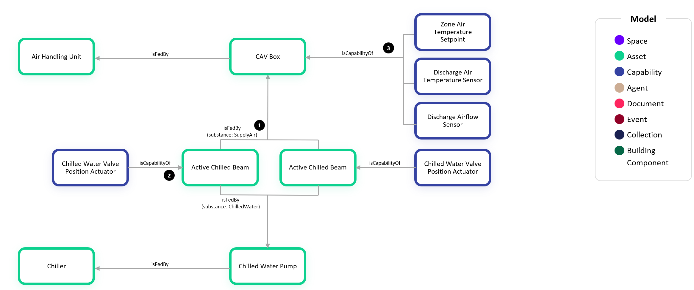

# Digital Twin Samples - HVAC

HVAC includes scenarios where temperature control and comfort of spaces is being performed by a building management system (BMS) and/or individual equipment controllers. Use cases include energy optimization, demand response, automated and predictive maintenance, and increasing productivity by improving comfort.

At a fundamental level, HVAC systems exchange energy and move air and water to condition a space. However, the configuration of HVAC systems can vary widely based on the climate of a location, size of the building, age of the building, and many other factors. While the configurations are limitless, this example shows a common scenario of conditioning air using an Air Handling Unit.

## HVAC Multi-Room Zone

1. An Air Handling Unit is one of the most complex equipment types to data model because it can come in many different configurations and be installed in many different scenarios. An Air Handling Unit has at least one inlet duct, conditions the air with cooling and heating elements, and sends the air out with at least one outlet duct. In this example, the conditioned air is sent to a Fan Powered Box which is a type of Terminal Unit. These equipment are connected via ductwork which is modeled using the isFedBy relationship. Not indicated on the relationship is the Supply Air substance which is being fed.

2. The Fan Powered Box conditions and regulates the air flow to the HVAC Zone space. The HVAC Zone is a core concept in the HVAC scenario. An HVAC Zone is a type of Space which has a boundary, generally aligns 1:1 with a Room, but can also be more granular or broader.

3. In this example, there are multiple Rooms within a single HVAC Zone. Because both Zones and Rooms are Spaces, we use the relationship isPartof to define the Rooms which are contained within the HVAC Zone.

4. In HVAC Systems, there is often a control network such as BACnet and controllers which host the control logic for the HVAC equipment. In this example, there is a single BACnet Controller which hosts the Capabilities that are associated with the Fan Powered Boxes. We use the hostedBy relationship to define which Capabilities the Controller manages.

5. Each Capability has a primary relationship to one or more Assets, Spaces, or Equipment Collections. In this example, the Zone Air Temperature Sensors each relate to a Fan Powered Box. We use the isCapabilityOf relationship to define which twin a Capability belongs to. By leveraging both the hostedby and isCapabilityOf relationships, this provides the flexibility to accommodate scenarios where an Asset’s Capabilities are hosted by separate Controllers as well as a Capability belonging to multiple entities.

## HVAC Multi-Zone Room

1. In this example, we show the flexibility in a zone where there are multiple Zones within one Room. Because both Zones and Rooms are Spaces, we use the relationship isPartof.

2. The HVAC Zone has a Zone Air Temperature Sensor Capability which directly corresponds to the Fan Powered Box capability because there is only a single Zone Temperature Sensor.

3. In some scenarios, an equipment such as a Fan Powered Box may have several Zone Air Temperature Sensors in which there is logic in the controller which averages or takes the minimum of maximum of the multiple sensor readers to determine its control sequence.

4. When there are multiple Zone Air Temperature Sensors (#3) serving a single HVAC Zone and the connection solution doesn’t calculate and emit the aggregate for the Zone, the Zone’s Temperature Sensor Capability (#4) will need to be calculated by the WillowTwin by performing an average function.

## HVAC Basic Relationships with Level

1. In this example, we show a scenario where it is not known which rooms are being conditioned by individual HVAC equipment, but it is known that the equipment is conditioning the 1st Floor. We establish the isPartOf relationship directly from the HVAC Zone to the Level. This is common when discovering HVAC equipment via a BMS connection but not having HVAC floor plans or not wanting to establish room-level fidelity.

2. The Fan Powered Box is located on the same floor that it is conditioning which is indicated by the locatedIn relationship.

3. Rooftop Units commonly condition spaces that are not on the same level in which they are located. The Rooftop Unit here is located on the Roof but conditions the 1st Floor.

## HVAC Pressurization Zone

1. In this example, we show how to configure an HVAC Pressurization Zone which is a type of HVAC zone whose control is setup to maintain a positive or negative pressure. These are commonly used in critical spaces such as laboratory and healthcare rooms which prevent the spread of contaminants in or out of spaces. These spaces often also have different ventilation requirements than standard occupiable HVAC zones. The HVAC Pressurization Zone isPartOf a Room just as a typical HVAC Zone would be configured.

2. The isFedBy relationships indicated the direction of the airflow. The Supply VAV Airflow Control Valves bring fresh air into the space while the General/Fume Exhaust VAV Airflow Control Valves exhaust air out of the space.

3. Fume Hoods may also be location in the space in which case the zone first feeds the Fume Hoods which then feed the Fume Exhaust VAV Airflow Control Valves.

4. The Exhaust VAV Control Valves across many zones often feed a common exhaust fan manifold which is shown as the Fan Group (HVAC). This equipment group consists of several Exhaust Fans that are staged and typically provide redundancy to the critical system.

5. There are many capabilities which are associated with the overall room. These are modeled as capabilities of the HVAC Pressurization Zone. A few of these are indicated in this example such as the Discharge Airflow Setpoint and Air Changes Per Hour but this is not an exhaustive list.

6. Similarly, each of the assets and asset groups shown in this example have capabilities associated with them. For simplicity on a few of these capabilities are shown such as the Face Velocity Setpoint on the Fume Hood or the Damper Position Actuator on the Supply VAV Airflow Control Valve.

## Dual Duct System

### Single Supply Fan AHU

1. In this example, we show how to configure a Dual Duct Air Handling Unit which has a single Supply Fan with two Air Handling Discharge Sections - one for heated air (Hot Deck) and one for cooled air (Cold Deck).

2. The Supply Fan has its own capabilities such as the Fan Run Level Actuator and Fan VFD Frequency Sensor.

3. Each of the Hot and Cold Deck AHU Discharge Sections has their own capabilities such as a Discharge Air Temperature Sensor.

### Dual Supply Fan AHU

1. In this example, we show how to configure a Dual Duct Air Handling Unit which has two Supply Fans, one for each discharge section. In this case, we have a Cold Deck Supply Fan and a Hot Deck Supply Fan in addition to the Hot and Cold Deck AHU Discharge Sections.

### Dual Duct VAV Box

1. In this example, we show how to configure a Dual Duct VAV Box which has a Hot Deck Inlet Damper and Cold Deck Inlet Damper.

2. Each Damper has their own capabilities such as the Damper Position Actuator.

3. Just like single duct systems, there is an isFedBy relationship from the VAV Box to the Air Handling Unit

## AHU Fan Arrays

### Single Fan Group

1. In this example, we show how to configure an Air Handling Unit which has multiple fans in the same section. This may be two fans as indicated here or a fan array with more individual fans. The Supply Fan Group has an isPartof relationship to the parent AHU.

2. Each Supply Fan is includedIn the Supply Fan Group. Note that the includedIn relationship is used because Fan Groups are asset collections and the Asset->Collection relationship uses includedIn rather than isPartOf.

3. Each Supply Fan has their own capabilities such as their Fan Run State.

4. Often the fans in the group will have common control points such as a single run level command. Here we show that the Supply Fan Group has a Fan Run Level Actuator and a Fan VFD Frequency Sensor.

### Independently Enabled Fan Groups

1. Some large fan arrays are divided into subsets of fans which can be enabled independently of each other, while the array as a whole is still driven by a single master enable and a single master speed command. Those master points command the entire array rather than any one fan or subset, so they are capabilities of the Air Handling Unit itself and use the Discharge Fan models - here a Discharge Fan Run Actuator and a Discharge Fan Run Level Actuator. The Discharge designation is what distinguishes them from the return, relief and exhaust fan commands which may also be capabilities of the same AHU.

2. Each independently enabled subset of the array is modeled as its own Supply Fan Group, and each Supply Fan Group has an isPartOf relationship to the AHU. In this example the first three fans can be enabled separately from the last three, so two Supply Fan Groups are shown. The presence of more than one Supply Fan Group is what makes the master points on the AHU necessary - with a single group, that group would carry the enable and speed points itself.

3. The run and speed points which belong to a subset are capabilities of that Supply Fan Group and use the plain Fan models - Fan Run State, Fan VFD Frequency Sensor and Fan Run Level Actuator. The Discharge designation is not used here, because these points belong to a component rather than to the AHU.

4. Each Supply Fan is includedIn its Supply Fan Group, in the same way as the single fan group example above.

5. Each individual Supply Fan carries its own Fan Run State.

### Where Fan Run and Speed Points Belong

Both examples above follow the same rule for the placement of fan run and speed points. The rule matters because it is what allows a rules engine to resolve whether an air handling unit is running.

1. Plain fan run and speed points belong on a fan, never on the AHU. Fan Run State, Fan Run Actuator, Fan Run Level Actuator, Fan Run Level State and Fan VFD Frequency Sensor should be a capability of a fan such as a Supply Fan, or of a fan group such as a Supply Fan Group. They should not be a direct capability of the Air Handling Unit.

2. Where the whole array is enabled together, which is the common case, use a single fan group. Model one Supply Fan Group holding the run and speed points for the array, with every fan includedIn that group, as in the first example. The plain Fan models are used on the group and the Discharge designation is neither needed nor wanted.

3. The Discharge Fan models are the narrow exception. Discharge Fan Run State, Discharge Fan Run Actuator, Discharge Fan Run Level Actuator and Discharge Fan Run Level State are the only fan run models which belong as direct capabilities of an AHU, and only in the case shown in the second example - a fan array whose subsets are enabled independently of each other, with a single master enable or speed command for the whole array. Those master points have no single fan or fan group to belong to, which is why they sit on the AHU. In practice the test is whether the AHU has more than one Supply Fan Group. If it has only one, that group can hold the array-wide enable and speed points itself, using the plain Fan models, and the Discharge Fan models are neither needed nor correct.

4. A Discharge Fan point attached to a fan or a fan group is incorrect. If a run or speed point is a capability of a component, it should use the plain Fan model. A Discharge Fan Run State attached to a Supply Fan, for example, should be a Fan Run State.

A plain fan point attached directly to the AHU is not merely unconventional, it is inert. A rules engine resolving the run status of an air handling unit looks first for a Discharge Fan Run State on the AHU, then for run points on the AHU's fan groups, then on the fans within those groups, and finally on fans attached directly to the AHU. No step in that sequence reads a plain Fan Run State from the AHU twin itself, so a point parented to the AHU by mistake binds to nothing and contributes nothing to whether the unit is considered enabled.

## Chilled Beam

Chilled Beams are a type of terminal unit located in a ceiling that receive chilled water to cool a space. Passive chilled beams use natural convection to provide conditioning to the space whereas active chilled beams have a primary air supply which forces the air into the space. Active chilled beams may also receive hot water to enable heating a space.

### Active Chilled Beam

1. Each Active Chilled Beam is fed by Supply Air from an upstream unit. In this example, we show that being a Constant Air Volume Box (CAV Box).

2. Each chilled beam has a chilled water valve so points associated with the individual chilled beam's valve are directly associated with the chilled beam.

3. Points that are associated with the room/zone or the primary supply air control are associated with the upstream unit which is controlling the airflow such as the CAV Box.