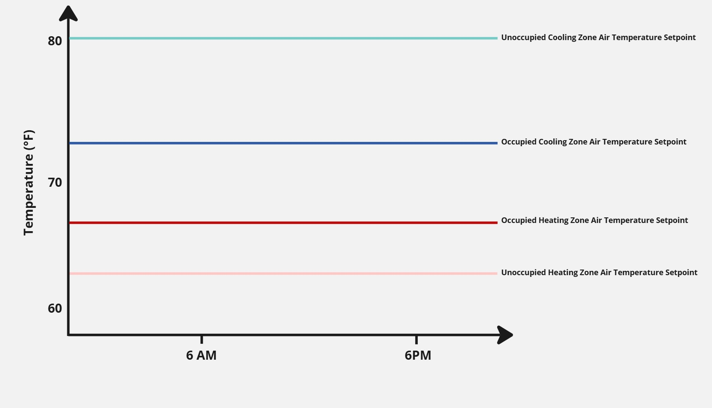
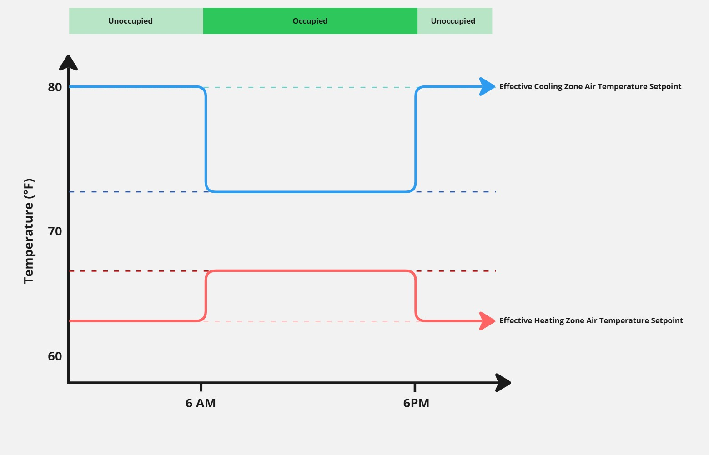
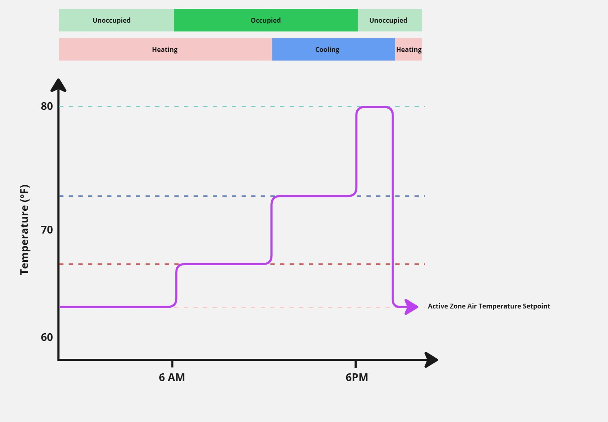
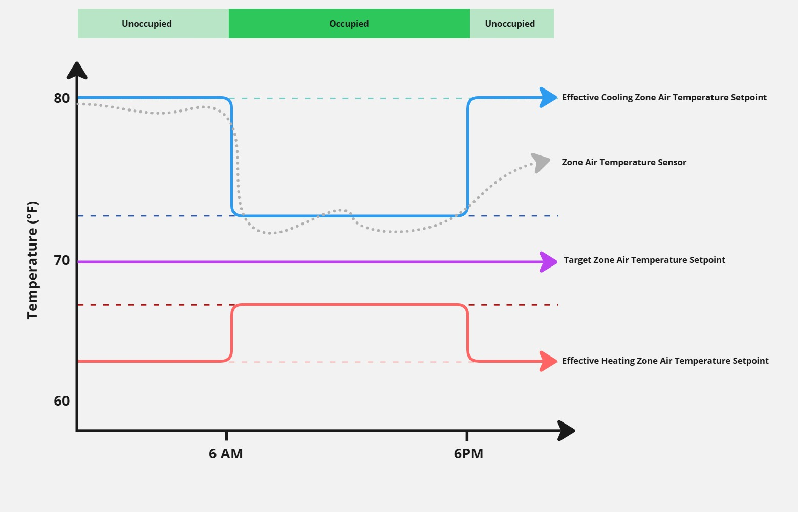

# Digital Twin Samples - HVAC Setpoints

This section will detail how to properly classify setpoints with the appropriate Willow ontology models. Because setpoints can be named similarly in different systems but have different behavior in how the system controls, it is important to properly classify according to the behavior. As such, when classifying points, it is often required to look at both the name and the time series to properly classify a point.

## Zone Temperature Heating and Cooling Setpoints

Zone temperature setpoints define the temperatures in the space (a.k.a. HVAC Zone) which the HVAC system is trying to maintain. If the temperatures sensor in the space exceeds a setpoint, the terminal unit, or other type of equipment serving the space, will condition the space until it returns to the desired temperature.

1. Zone temperature heating and cooling setpoints define the temperatures that a terminal unit will use as the lower and upper bounds for maintaing a space's temperature. When the space temperature drops below the heating setpoint, the unit will heat the space. When the space temperature rises above the cooling setpoint, the unit will cool the space.

> [!NOTE] 
> Some equipment are programmed to only be able to heat or cool based on a predefined mode - heating mode or cooling mode - and cannot dynamically change the mode. This can be recognized when a space temperature is allowed to exceed one of the heating or cooling setpoints.

2. Most zones also have occupancy modes which adjust the heating and cooling setpoints based on whether people are expected to be in the space. These are required by ASHRAE 90.1 for energy savings when spaces are unoccupied. Typically a weekly schedule is setup to define which times in a given day of the week the zone will be in occupied or unoccupied modes. The point which defines the current mode should be classified as `Occupied State`.

Because there are occupied and unoccupied setpoints for both heating and cooling, we have four points to classify as follows:
* `Occupied Cooling Zone Air Temperature Setpoint`
* `Unoccupied Cooling Zone Air Temperature Setpoint`
* `Occupied Heating Zone Air Temperature Setpoint`
* `Unoccupied Heating Zone Air Temperature Setpoint`

These four setpoints do not change over the course of a given day or even week as they are fixed parameters defined in the programming. Their time series should be a flat line. The only time they will change is if someone changes the programming in which case they will change at that point in time to the new values moving forward.

## Zone Temperature Effective Setpoints

An effective zone temperature setpoint is one that does change over the course of a day based on the current occupancy mode (i.e. occupied, unoccupied, or standby) as described above. When in occupied mode, the effective setpoints will match that occupied setpoints. When in unoccupied mode, the effective setpoints will match the unoccupied setpoints.

Because there are effective setpoints for both heating and cooling, we have two points to classify as follows:
* `Effective Cooling Zone Air Temperature Setpoint`
* `Effective Heating Zone Air Temperature Setpoint`

> [!NOTE] 
> Some equipment will only expose these two effective setpoints rather than each of the four individual occupied/unoccupied, heating/cooling setpoints listed above. This can be recognized by the time series oscillating between two temperatures.

> [!IMPORTANT] 
> The model `Effective Zone Air Temperature Setpoint` should NOT be used as the exact model for a point. This is an abstract model that the above Effective Cooling/Heating extend from. See below section on `Active` setpoints if there is a single setpoint which reflects the currently used setpoint at all times.

## Zone Temperature Active Setpoint

The active zone temperature setpoint is one that changes over the course of a day and reflects the current value to which the space temperature is being controlled based on all operating modes and conditions such as occupied/unoccupied/standby and heating/cooling. If there is a single setpoint which reflects how the space temperature is being controlled, classify the point as:
* `Active Zone Air Temperature Setpoint`

## Zone Temperature Target Setpoint

Sometimes there is a zone temperature setpoint which does not change over the course of a day like the effective or active setpoints do, but the point also is not defined as a heating or cooling setpoint. This is typically a `Target` setpoint which is a central setpoint from which the heating and cooling setpoints are derived from. This type of point should be classified as:
* `Target Zone Air Temperature Setpoint`

This point is also recognizable when the space temp does not seek this temperature like it does the other setpoints. For exmaple, a target temperature may be 72F with an Occupied Cooling Setpoint of 74F and an Unoccupied Cooling Setpoint of 78F. During the summer time while in cooling season, the space temperature will likely never approach 72F but rather consistently be between 74F and 78F based on which occupancy mode.

