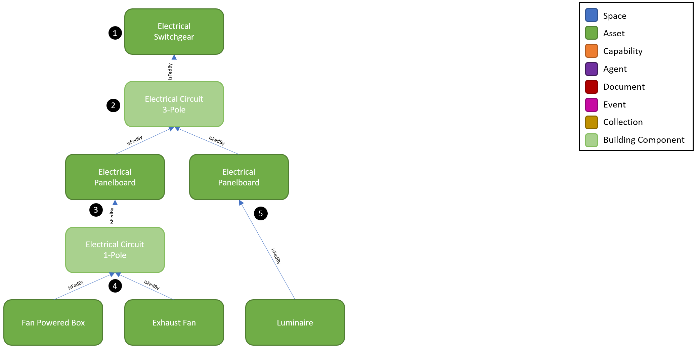

# Digital Twin Samples - Electrical

Electrical includes scenarios where electrical distribution, storage, and generation equipment can be managed and analyzed in the digital twin. Use cases include understanding impacts on downstream equipment when servicing electrical gear, load management and planning, demand response, emergency and redundant power simulation, and digitizing panel schedules.

Electrical systems have common equipment found various sites but vary widely in terms of how many tiers of distribution are involved from a service entrance to the loads. Also, the transformation of voltage and introduction of redundant or emergency power sources can vary depending on the electrical design. While the configurations are limitless, this example shows a common scenario found within most sites.

## Electrical Distribution

1. The Electrical Switchgear is located at the service entrance to a site. It is typically fed by a utility transformer (not shown) and serves as the main point of electrical distribution for a site.

2. When circuit identifiers are known, the digital twin can define which circuits feed which downstream equipment. For large equipment, these circuits may be shown on a single-line diagram. In this example, a 3-pole Electrical Circuit feeds two electrical panelboards.

3. The Electrical Panelboard is the most common piece of electrical distribution equipment. A typical configuration allows for 42 branch circuit poles which are traditionally managed via a panel schedule inside the panel.

4. In this example, we show one of those 1-Pole Electrical Circuits feeding a Fan Powered Box and Exhaust Fan.

5. In many instances, the exact circuit assignment of an equipment may be unknown but the panel from which it is fed is known based on the electrical design. In this example, we show a Luminaire which is fed by an Electrical Panelboard.