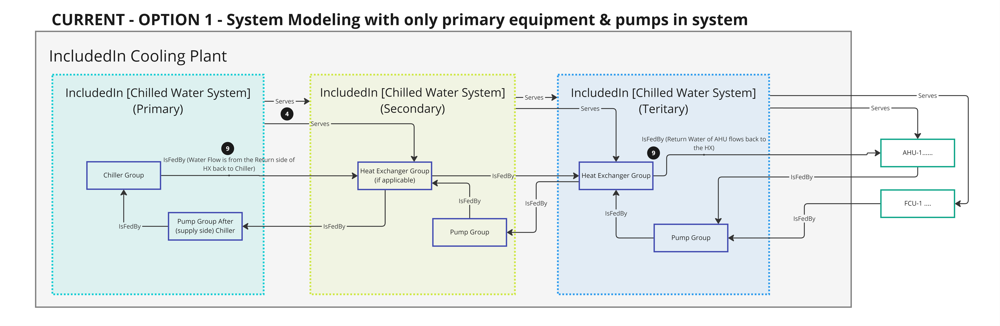
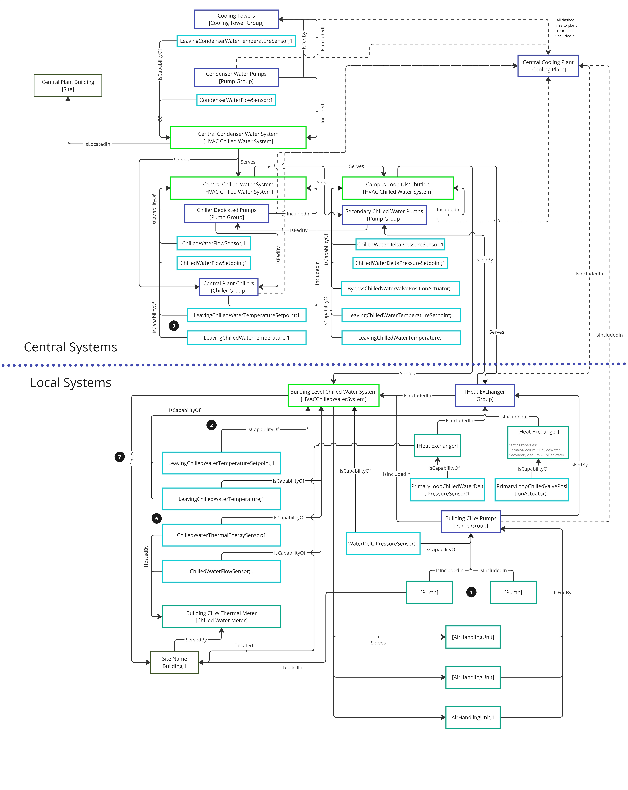

# Digital Twin Samples - HVAC Systems and Plants

## HVAC Systems

An HVAC Water System is a single closed loop hydronic (or single-pressure steam distribution) including all equipment within the distribution. This is similar to the Loop concept in both Haystack and Brick for how a system with a single loop might be modeled. A chilled water system might include chillers, pumps, and AHUs and terminal equipment with hydronic cooling coils served by the system.

HVAC Systems include ChilledWaterSystem, HotWaterSystem, CondenserWaterSystem, and SteamSystem.

1. The equipment contained within the system should be modeled as follows: Asset -> isPartOf -> AssetGroup -> isIncludedIn -> HVACSystem.

2. There should be one Leaving Supply Temperature/Pressure/Flow and one Leaving Supply/Temperature/Pressure/Flow Setpoint per system. There can be all three pairs (temperature/pressure/flow), but there should not be more than one input and one setpoint for system, unless the duplicate setpoints are for a high limit and low limit. This definition can help distinguish system lines when they may be ambiguous (bypass, three way valve, etc.).These points should be modeled as IsCapabilityOf the system not the primary equipment group.

3. Simple Leaving "system" water temperature and Leaving "system water temperature setpoint models should be used on systems rather than specifying between primary/secondary/tertiary. Primary/secondary/tertiary are communicated in the twin "NAME" only.

4. There should be a Serves/Served By relationship from systems to the secondary equipment in the hydronic loop to represent the flow of load within the system. In the example of a primary chilled water system that represents the fluid loop from chillers, primary pumps to heat exchangers that separate the primary and secondary systems, the heat exchangers should be modeled as follows Ex: Primary System > Serves > PrimarySecondaryHeatExchanger. 

5. If there is a bypass/ balancing line. A new system must be created since the bypass/ balancing line will be controlling to a separate flow/ temperature/ pressure setpoint than the cooling equipment.

6. Capabilities of thermal meters that meter either the primary equipment as a whole or the whole system should have IsCapabilityOf relationships to the HVAC system not the primary equipment group.

7. The "highest level" system in a building should have a Serves relationship to the Building. The "highest level" system is defined as the system that is not served by but only serves other systems within a building and contains equipment that is located in the building.

8. Since these relationships are based on piping configurations and sensor locations, BMS graphics or design drawings will need to be referenced in creation of these systems.
   

# HVAC Plants

An HVAC Plant is the the collection of equipment responsible for the production of COOLING or HEATING that are connected together. A plant should not include any equipment that is part of the system that only has hydronic coils (e.g. an AHU with hydronic cooling coil will be part of the ChilledWaterSystem but not part of the ChilledWaterPlant, however an AHU with a DX cooling coil will be part of the CondenserWaterPlant). 

HVAC Plants include CoolingPlant (child models include ChilledWaterPlant, CondenserWaterPlant, and VRFCoolingPlant for desired specificity) and HeatingPlant (child models include HotWaterPlant, SteamPlant, and VRFHeatingPlant for desired specificity)

A practical use for a plant will be to aggregate the total energy consumption of all equipment within the plant that produces and distributes heating/cooling (e.g. power consumption of all pumps, chillers, cooling towers, DX compressors), and the power output of the plant in tons of cooling or MBH of heating. Ideally, both should be inferred from the content of the plant alone, but in some cases we would have to rely on end-use equipment at the system-level, instead (e.g. the heat output of a steam coil at an AHU can only be inferred by the heat pickup of air across the coil).

1. A PLANT is the the collection of equipment responsible for the production of COOLING or HEATING that are connected together. A plant should not include any equipment that is part of the system that only has hydronic coils (e.g. an AHU with hydronic cooling coil will be part of the ChilledWaterSystem but not part of the ChilledWaterPlant).

2. The equipment contained within the group should be modeled as follows: Asset -> isPartOf -> AssetGroup -> isIncludedIn -> HVACPlant
