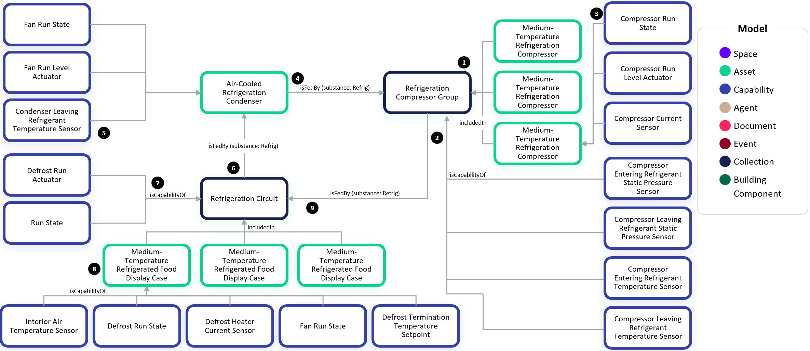
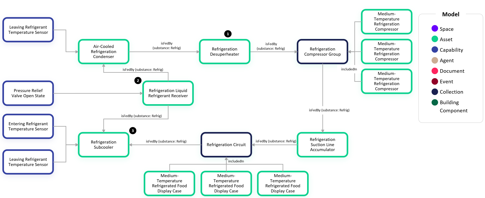

# Digital Twin Samples - Refrigeration

## Basic Rack Refrigeration System

Refrigeration systems are often mission critical for food, beverage, pharmaceutical and chemical storage and ice storage. This scenario shows how to model these systems:

1. Many modern refrigeration systems have a rack of compressors operating as a group. In this scenario, we have three medium-temperature compressors that are included in the group.

2. The group has a common inlet in which the refrigerant is returning to the compressors from the evaporators (i.e. Food Display Cases). This is often referred to as the suction side of the compressors. The group also has a common discharge manifold. In this example, there are entering pressure and temperature sensors (suction side) to this compressor group and leaving pressure and temperature sensors (discharge side).

3. When an individual compressor has telemetry associated with it, we attached the capabilities directly to the compressor twin. In this example, we show common telemetry points such as the run state, run level actuator (aka run level command), and current sensor.

4. We use an isFedBy relationship from the Condenser to the Refrigeration Compressor group to indicate that the refrigerant is leaving the compressors and traveling towards the condenser. With all isFedBy relationships in this diagram, we include the property `substance` and set it to `Refrig` to denote that this is refrigerant.

5. Condensers will also have several telemetry points associated with them such as their fan run state and fun level actuator (aka run level command). The `Condenser Leaving Refrigerant Temperature Sensor` is often referred to as the drop leg temperature in a refrigeration system.

6. Next the refrigerant leaves the Condenser and heads towards the load which are the evaporators. Many modern systems will include several Refrigeration Circuits that are being fed from the same Condenser. These Circuits feed a group of evaporators. In this example, we show a Refrigeration Circuit containing three Medium-Temperature Refrigerated Food Display Cases. There will often be many more display cases in an individual circuit.

7. Each Refrigeration Circuit may have points that are associated with it such as a Defrost Run Actuator and Run State. These are often common control points that affect all Cases on the Circuit.

8. Each Refrigerated Food Display Cases can be classified as Medium-Temperature or Low-Temperature. Medium temperature cases are used for refrigerated temperatures whereas low temperature cases require temperatures below freezing. It is important to classify medium vs low temperature as many analytics will depend on this.

9. To complete the loop of refrigerant, we denote that the compressor group isFedBy the Refrigeration Circuit.

## Refrigeration System with Additional Assets

In this example, we expand upon the previous example to show additional assets that are commonly included in the refrigeration system:

1. A Refrigeration Desuperheater is located between the compressors and the condenser. It is a heat exchanger responsible for removing heat from the compressor discharge gas before it enters the condensers.

2. A Refrigeration Receiver is a storage tank which acts as a reservoir for excess refrigerant. It is important for increasing efficiency by ensuring there is always liquid refrigerant entering the evaporators and that excess refrigerant does not back up into the condenser coils.

3. A Refrigeration Subcooler is located between the Condenser and evaporators as well. While some subcoolers are integral to the condenser, in this example we show a dedicated subcooler which is a heat exchanger responsible for dropping the refrigerant temperature before it gets to the expansion valve feeding the evaporators.