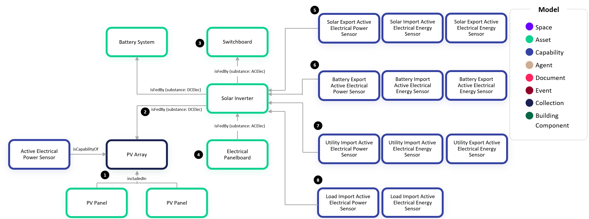

# Digital Twin Samples - Electrical

Electrical includes scenarios where electrical distribution, storage, and generation equipment can be managed and analyzed in the digital twin. Use cases include understanding impacts on downstream equipment when servicing electrical gear, load management and planning, demand response, emergency and redundant power simulation, and digitizing panel schedules.

Electrical systems have common equipment found various sites but vary widely in terms of how many tiers of distribution are involved from a service entrance to the loads. Also, the transformation of voltage and introduction of redundant or emergency power sources can vary depending on the electrical design. While the configurations are limitless, this example shows a common scenario found within most sites.

## Electrical Distribution

1. The Electrical Switchgear is located at the service entrance to a site. It is typically fed by a utility transformer (not shown) and serves as the main point of electrical distribution for a site.

2. When circuit identifiers are known, the digital twin can define which circuits feed which downstream equipment. For large equipment, these circuits may be shown on a single-line diagram. In this example, a 3-pole Electrical Circuit feeds two electrical panelboards.

3. The Electrical Panelboard is the most common piece of electrical distribution equipment. A typical configuration allows for 42 branch circuit poles which are traditionally managed via a panel schedule inside the panel.

4. In this example, we show one of those 1-Pole Electrical Circuits feeding a Fan Powered Box and Exhaust Fan.

5. In many instances, the exact circuit assignment of an equipment may be unknown but the panel from which it is fed is known based on the electrical design. In this example, we show a Luminaire which is fed by an Electrical Panelboard.

## Solar and Battery

This electrical active efficiency scenario depicts a common setup where a Solar Inverter is the central hub for managing incoming power generation from a PV Array, incoming/outgoing power to a battery system, and then importing/exporting power from the grid to send to downstream loads.

1. The Photovoltaic Array (PV Array) is a collection which includes many individual PV Panels. The quantity and layout of individual panels may not always be known so having the PV Panel twins is considered optional. When a solar system provides a trend of the DC power generation from the PV Array, we add an Active Electrical Power Sensor capability to the PV Array.

2. An “is fed by” relationship from the Solar Inverter to the PV Array indicates that positive power generation flows from the PV Array to the Solar Inverter. Note that the substance property on the relationship is defined as DCElec. 

3. The Solar Inverter also receives ACElec power from the utility grid. In this example, we have a Switchboard which serves as the site utility service, but this could be another type of Electrical Distribution Equipment.

4. The Solar Inverter then sends power to the downstream loads at the site. This example shows an Electrical Panelboard, but this could be another type of Electrical Distribution Equipment. Notice the direction of the “is fed by” relationship. This indicates that a positive power indicates flow from the Solar Inverter to the Electrical Panelboard.

5. Three capabilities for Solar Export Active Electrical Power Sensor, Solar Import Active Electrical Energy Sensor, and Solar Export Active Electrical Energy Sensor indicate the AC power and energy that the inverter has generated from the DC power coming from the PV Array. The solar export power and export energy are commonly reported as the solar power and energy production at a site. The solar import energy is less common but indicates energy consumed by the PV array when there is no production.

6. Similarly, three capabilities for the Battery system indicate the power and energy that the battery has discharged. A positive power value indicates the battery discharging while a negative value indicates the battery charging. The export energy accumulates the energy while the battery is discharging while the import energy accumulates the energy while the battery is charging.

7. The Utility import power, import energy, and export energy indicate the AC power and energy that is coming from the grid. In this case, they indicate what is being received by the Switchboard. If the power is positive, that indicates an import of power from the grid. If it is negative, that indicates an export of power when an excess of power is being produced onsite and being sent to the grid. The import energy accumulates energy being consumed by the site while the export energy accumulates energy being exported to the grid.

8. The Load import power and import energy indicate the AC power and energy that is being consumed by the loads. In this case, they indicate what is being sent to the Electrical Panelboard. These values must be positive since loads can only consume energy.