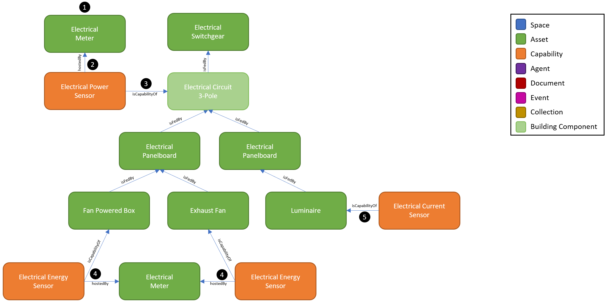
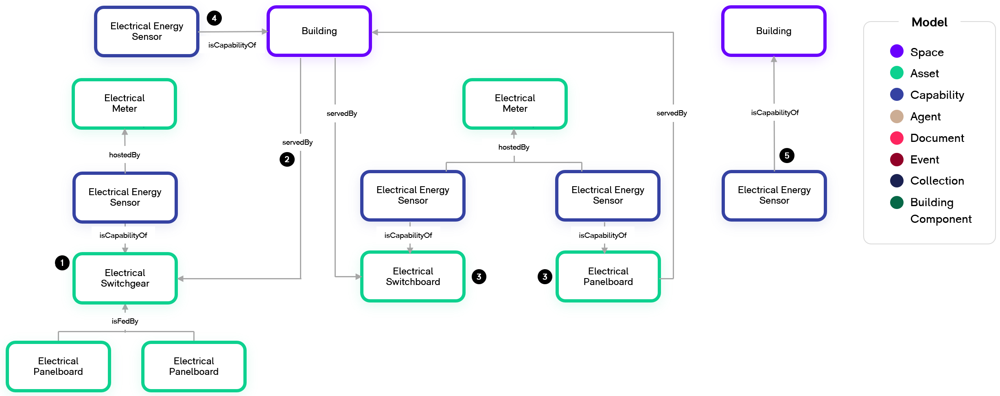
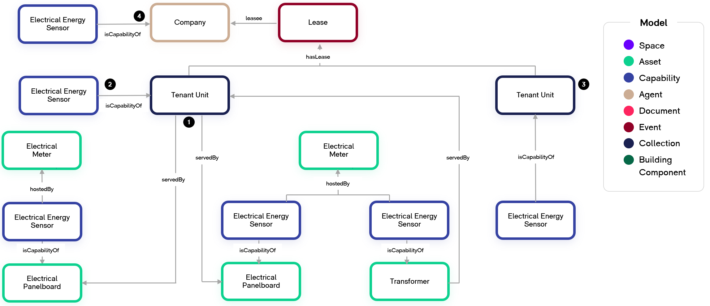
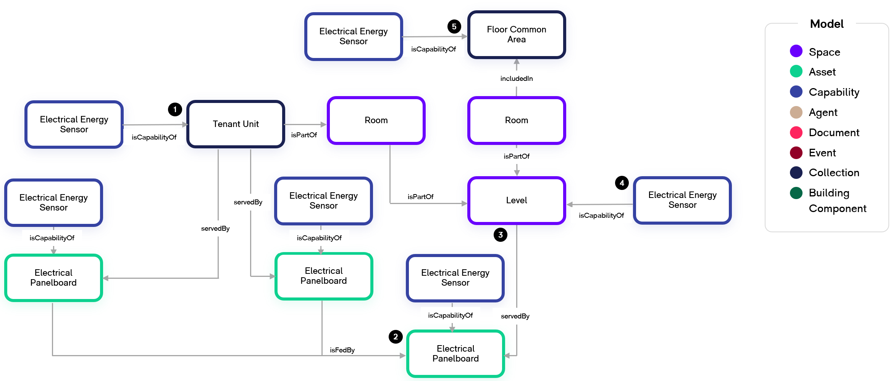
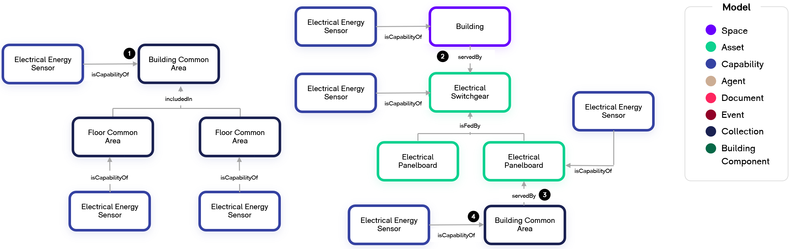
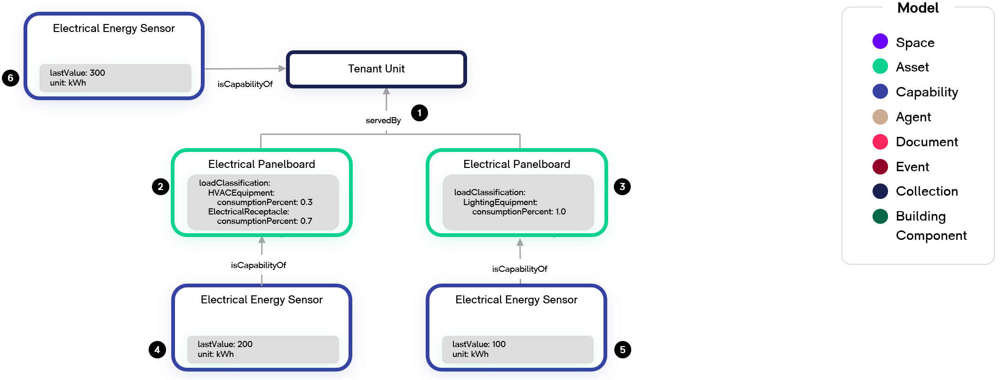
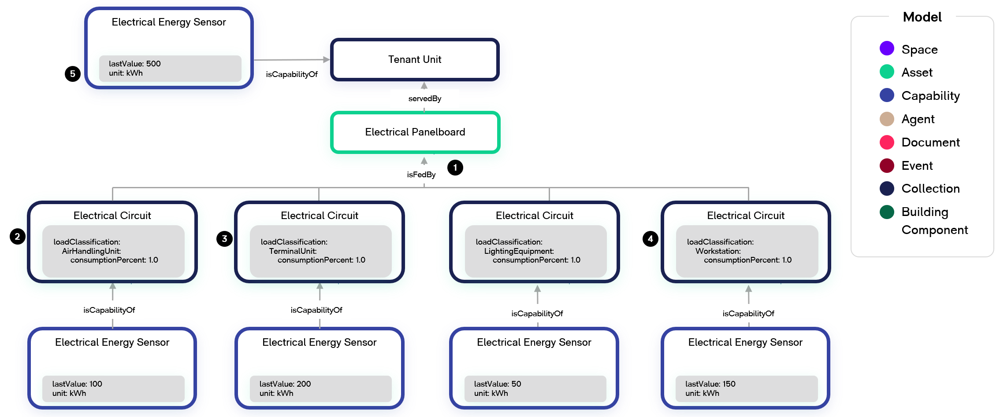

# Digital Twin Samples - Metering

Metering encompasses scenarios where a physical or virtual meter device is measuring the flow of a substance such as electricity, fluid volume, or fluid mass to determine consumption by the recipient of the substance. The recipient could be an individual asset but is often mapped to a broader concept such as a building, tenant company, or space.

## Electrical Metering

In this example, we expand upon the Electrical distribution example and introduce Electrical Metering which measures the energy, power, and current being transmitted by circuits and consumed by equipment.

1. Electrical Meters are a physical assets that have many different configurations. In this example, we show an Electrical Meter which is measuring the 3-Pole Electrical Circuit.

2. A 3-phase Electrical Meter can have many Capabilities relating to energy, power, and current for individual phases, between phases, and total. It may also compute power quality metrics such as total harmonic distortion, phase angles, and imbalance. In this example, we show an Electrical Power Sensor as just one of many Capabilities that the Meter has. We use the hostedBy relationship between the Capability and the Meter similar to how hostedBy is used with BMS Controllers.

3. The Electrical Power Sensor is measuring the Electrical 3-Phase Circuit. We use isCapabilityOf to define this relationship. This flexibility abstracts the Meter Asset hardware from the actual Capabilities it is hosting providing flexibility for many different metering scenarios. If a physical meter asset is measuring many circuits, this allows each Capability to be assigned to its associated Electrical Circuit which it is measuring.

4. In some instances, the Electrical Meter may be directly monitoring equipment (i.e. plug load meters) or individual twins of the electrical circuits may be not be created. In this example of a branch circuit meter, the Electrical Meter is trending two Energy Sensor metrics which is defined with the hostedBy relationship. The isCapabilityOf relationship assigns the Capability to a Fan Powered Box and an Exhaust Fan.

5. In some instances, a physical meter asset may be unknown or non-existent in the design. In this example, we show that the Luminaire is reporting its Electrical Current which may be a built-in Capability of that Luminaire.

## Assigning Meters to Buildings

In this example, we depict how metering measurements get assigned to a space such as a Building. 

1. The Electrical Switchgear is an electrical service entrance for the building. It has an Electrical Meter measuring the incoming circuit from the utility. We are showing one of the capabilities of the meter, Electrical Energy Sensor, which is hostedBy the Electrical Meter and isCapabilityOf the Electrical Switchgear.

2. We use the servedBy relationship from the Building to the Electrical Switchgear to indicate the service entrance relationship and thus all capabilities related to the Electrical Switchgear (i.e. Electrical Energy Sensor) can be attributed to the Building’s metering aggregate calculations.

3. Many buildings may have multiple service entrances from the utility each with their own meters. In addition to the first service entrance indicated by #1, this building has two additional service entrances indicated by #3 each with their own metering capabilities. Note that various types of Electrical Distribution Equipment may be used at electrical service entrances such as a Switchboard or Panelboard, but they can each still be attributed to the Building with the servedBy relationship.

4. Because the Building has three service entrances, the WillowTwin will calculate the aggregate energy for the building by summing up the Electrical Energy Sensors of each service entrance and assigning it to the Building in #4.

5. In other scenarios, the Building’s total energy consumption may be ingested directly into the WillowTwin. The same isCapabilityOf relationship is used in #5 as the calculated Electrical Energy Sensor in #4 which allows the WillowTwin to treat them the same regardless of how the calculation was performed by the underlying metering topology.

## Assigning Meters to Tenant Units and Companies

In this example, we replace the Building from the previous example with a Tenant Unit.

1. We indicate a similar scenario as the Building examaple above where the Tenant Unit has three meters which act as separate services for the space. The servedBy relationship is used from the Tenant Unit to each of the electrical service equipment - two Electrical Panelboards and a Transformer.

2. The WillowTwin calculates the aggregate energy for the Tenant unit by summing up each of the Electrical Energy Sensor capabilities at the service entrances.

3. Another Tenant Unit within the building has an Electrical Energy Sensor representing its energy consumption.

4. If we are interested in calculating the aggregate energy for a Company which is leasing both Tenant Units (#1 and #3), we leverage the relationship of a Company having a Lease for the Tenant Units as indicated in the Leasing Space example.

## Assigning Meters to Levels and Floor Common Areas

1. In this example, we expand on the previous example where we’ve assigned two panelboards to a Tenant Unit using the servedBy relationship and the WillowTwin calculates the aggregate energy indicated by the Electrical Energy Sensor as a direct capability of the Tenant Unit.

2. It is common electrical design that a floor Electrical Panelboard subfeeds tenant panelboards as well as the common areas of the floor.

3. We use the servedBy relationship to indicate that the Electrical Energy Sensor for the floor Electrical Panelboard can be attributed as the floor’s (Level’s) total energy consumption.

4. The WillowTwin calculates the Level’s energy consumption indicated by the Electrical Energy Sensor.

5. The WillowTwin also calculates the net energy consumed by the Floor Common Area indicated by the Electrical Energy Sensor. In this example, this would be calculated by subtracting the Tenant Unit Electrical Energy Sensor from the Level Electrical Energy Sensor.

## Assigning Meters to Building Common Areas

1. When the Floor Common Areas account for the entirety of the base building space, the Building Common Area’s energy consumption may be calculated by the WillowTwin as the sum of all Floor Common Areas’ Electrical Energy Sensors via the includedIn relationship.

2. Alternatively, there may not be Floor Common Areas defined but rather a Building whose energy consumption was calculated via the servedBy relationship to the Electrical Switchgear as the service entrance.

3. Here we indicate that a Building Common Area twin is served by an Electrical Panelboard which has been fed from the Building’s Electrical Switchgear service entrance. The Electrical Panelboard has its own Electrical Energy Sensor.

4. The Building Common Area’s Electrical Energy Sensor is calculated by the WillowTwin using the servedBy relationship.

## Load Classification - Electrical Panelboards

Metering load classification enables analytics to make assumptions on what types of assets are consuming energy, gas, or water. The output is a breakdown of the total consumption by asset classification.

1. In this example, we have the Tenant Unit being servedBy multiple Electrical Panelboards which each have Electrical Energy Sensors from a Meter.

2. Panelboards are often designated as serving a particular load classification such as Plug Loads, Lighting, or HVAC. When the meter is only measuring the panelboard’s main incoming circuit and not the individual branch circuits, we define the ‘loadClassification’ property on the Electrical Panelboard twin. This is a means of indicating how much of the energy consumption can be attributed to the defined asset class. The total should always add to 1.0 (100%). This Electrical Panelboard has designated HVAC Equipment as 30% and Electrical Receptacles as 70%. The loadClassifications must be a shortened DTDL model identifier (doesn’t include full path or version) of an asset or group of assets. This enables WillowTwin to perform roll ups across an entire Building and understand that a loadClassification of AirHandlingUnit contributes to the overall HVACEquipment consumption.

3. This Panelboard has been designated as entirely connected to lighting loads so has been given the load classification for Lighting Equipment as 100%.

4. WillowTwin is now able to breakdown how much of the Electrical Energy Sensor’s values can be attributed to each load classification. For the Panelboard identified in #2, there is a total energy consumption of 200 kWh of which 60 kWh is HVAC Equipment and 140 kWh is Electrical Receptacle.

5. The Panelboard identified in #3 has a total energy consumption of 100 kWh of which all 100 kWh is Lighting Equipment.

6. The total energy consumed by the Tenant Unit is 300 kWh across both Panelboards. By leveraging the load classifications, we see that 20% (60 kWh) is HVAC Equipment, 46.67% (140 kWh) is Electrical Receptacle, and 33.33% (100 kWh) is Lighting Equipment.

## Metering Load Classification - Branch Circuit

1. In this example, we showcase how branch circuit metering can provide more granular load classification reporting. There is an Electrical Panelboard with branch circuit metering, and we are showing four of those circuits being fed by the Panelboard

2. When there is branch circuit metering, we require panel schedules or full electrical circuiting floor plans to determine the load classification for each circuit which is being metered. This Electrical Circuit is defined as feeding an Air Handling Unit. Individual circuits generally only feed a single asset or class of assets, but when a single circuit feeds different asset classifications, we could use the same method as shown for panel level load classification by defining percentages to each.

3. This circuit is feeding one or more Terminal Units. Because a Terminal Unit is a type of HVAC Equipment just like the previous circuit Air Handling Unit, the WillowTwin can offer reports that show an aggregate for HVAC Equipment or the individual HVAC Equipment categories.

4. This circuit is feeding Workstations.

5. WillowTwin is now able to breakdown how much of the Electrical Energy Sensor’s values can be attributed to each load classification. For this example, the total energy consumed by the Tenant Unit is 500 kWh. By leveraging the load classifications, we see that 20% (100 kWh) is Air Handling Unit, 40% (200 kWh) is Terminal Unit, 10% (50 kWh) is Lighting Equipment, and 30% (150 kWh) is Workstation.
