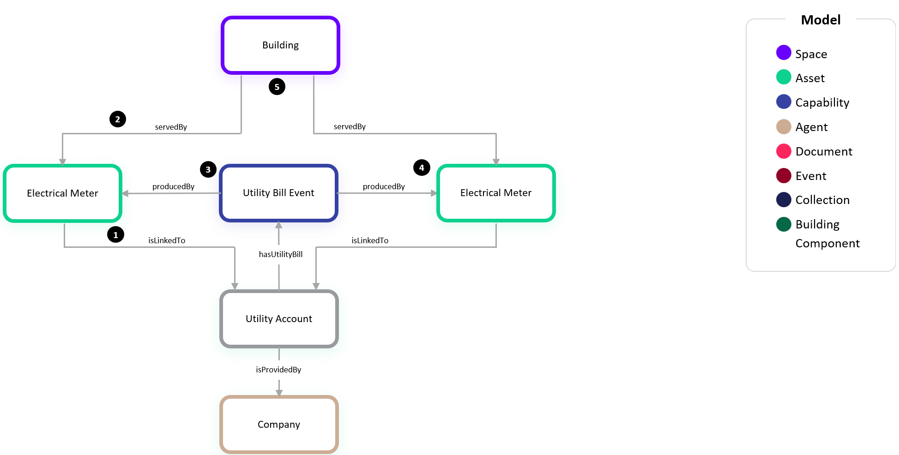
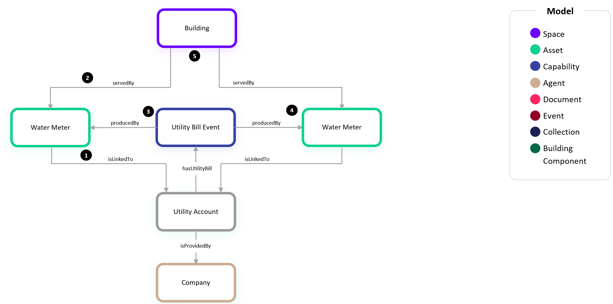
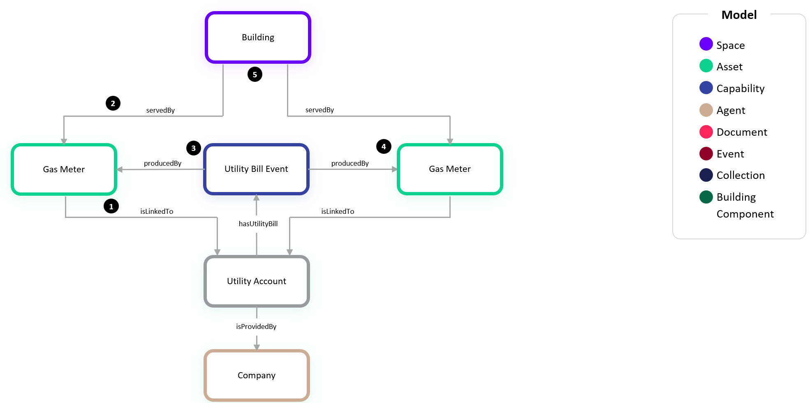

# Digital Twin Samples - Utilities

Utilities encompasses scenarios where a utility company is providing a utility service to a customer's space such as a building, campus, or tenant unit and generates monthly bills for the service and consumption of a commodity such as electricity, water, or internet. These examples show how to model the concepts of utility accounts, bills, and associated meters.

## Billed Utility Metering

### Electricity

Billing for electricity consists of one or more meters which serve a Building that may be on the same Utility Account. In this example, we show a Building with two services on the same Utility Account:

1. The first Electrical Meter is linked to the Utility Account which is provided by the Company which offers the utility service.

2. The Building is served by the Electrical Meter just as is the case for customer-owned meters shown in the Metering samples.

3. The Utility Account has a 1:1 relationship with a [Utility Bill Event](<../Ontology/Willow/Event/Utility Bill/UtilityBillEvent.json>). This Utility Bill Event corresponds to the monthly generated bill which gets trended similar to a Capability. The Utility Bill Event also has produced by relationships to the meters for which it includes billing details. The payload for a Utility Bill Event includes details about the billing period start/end dates, total charges, and an array of objects listing the consumption and individual charges for each meter for that billing period for measurements such as the energy consumption (kWh) and demand (kW).

4. The second meter is also linked to the same Utility Account and Utility Bill Event signifying that the Utility Bill Event also includes billing information for that meter.

5. To determine the totals for this Building, the sum of each respective meter's measurements in the Utility Bill Event should be taken.

### Water

Similar to Electricity, billing for water consists of one or more meters which serve a Building that may be on the same Utility Account. These meters may both be for potable water or they could be offering different types of water service such as reclaimed water commonly used for irrigation. In this example, we show a Building with two services on the same Utility Account:

1. The first Water Meter is linked to the Utility Account which is provided by the Company which offers the utility service.

2. The Building is served by the Water Meter just as is the case for customer-owned meters shown in the Metering samples.

3. The Utility Account has a 1:1 relationship with a [Utility Bill Event](<../Ontology/Willow/Event/Utility Bill/UtilityBillEvent.json>). This Utility Bill Event corresponds to the monthly generated bill which gets trended similar to a Capability. The Utility Bill Event also has produced by relationships to the meters for which it includes billing details. The payload for a Utility Bill Event includes details about the billing period start/end dates, total charges, and an array of objects listing the consumption and individual charges for each meter for that billing period for measurements such as the water consumption (typically in Gallons or Liters) and peak demand/rate (typically in GPM or LPM).

4. The second meter is also linked to the same Utility Account and Utility Bill Event signifying that the Utility Bill Event also includes billing information for that meter.

5. To determine the totals for this Building, the sum of each respective meter's measurements in the Utility Bill Event should be taken.

### Natural Gas

Similar to Electricity and Water, billing for natural consists of one or more meters which serve a Building that may be on the same Utility Account. In this example, we show a Building with two services on the same Utility Account:

1. The first Gas Meter is linked to the Utility Account which is provided by the Company which offers the utility service.

2. The Building is served by the Gas Meter just as is the case for customer-owned meters shown in the Metering samples.

3. The Utility Account has a 1:1 relationship with a [Utility Bill Event](<../Ontology/Willow/Event/Utility Bill/UtilityBillEvent.json>). This Utility Bill Event corresponds to the monthly generated bill which gets trended similar to a Capability. The Utility Bill Event also has produced by relationships to the meters for which it includes billing details. The payload for a Utility Bill Event includes details about the billing period start/end dates, total charges, and an array of objects listing the consumption and individual charges for each meter for that billing period for measurements such as the natural gas consumption (typically in Therms, MCF, or CCF) and daily peak demand (typically in Therms, MCF, or CCF).

4. The second meter is also linked to the same Utility Account and Utility Bill Event signifying that the Utility Bill Event also includes billing information for that meter.

5. To determine the totals for this Building, the sum of each respective meter's measurements in the Utility Bill Event should be taken.

### Electrical - Supply and Delivery (Coming Soon)

Billing for electricity and natural gas consists of both supply and delivery charges. Depending on the location, these may be from the same or different companies, and they may appear on the same or different bills each month. As such, this example shows an example where these are provided by different companies and appear on different bills.