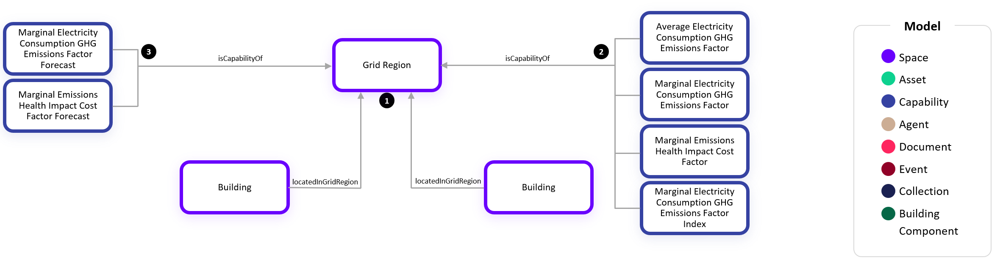

# Digital Twin Samples - Grid Emissions

## Grid Emissions

Signals from the electricity grid are important for load shifting, quantifying energy reduction impacts, and GHG accounting. In this example, we show how to assign buildings to a grid region:

1. A Grid Region has one or more Buildings that use the locatedInGridRegion relationship to specify which grid region they are placed. Other Spaces such as Outdoor Areas, Substructures, or Land could also be located in a Grid Region.

2. A Grid Region has several historical trends which are associated with it such as the Average Electricity Consumption GHG Emissions Factor, Marginal Electricity Consumption GHG Emissions Factor, and Marginal Emissions Health Impact Cost Factor.

