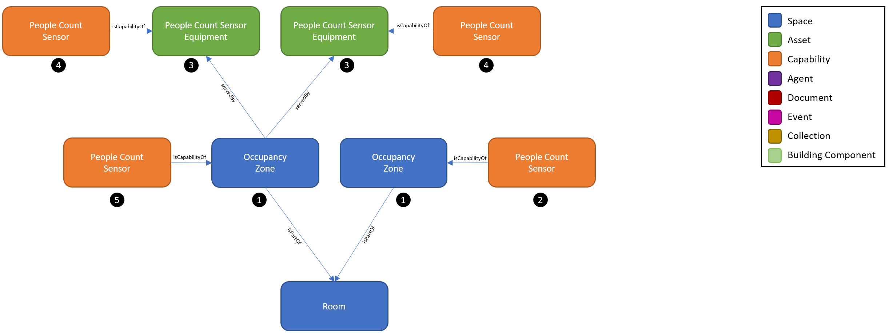
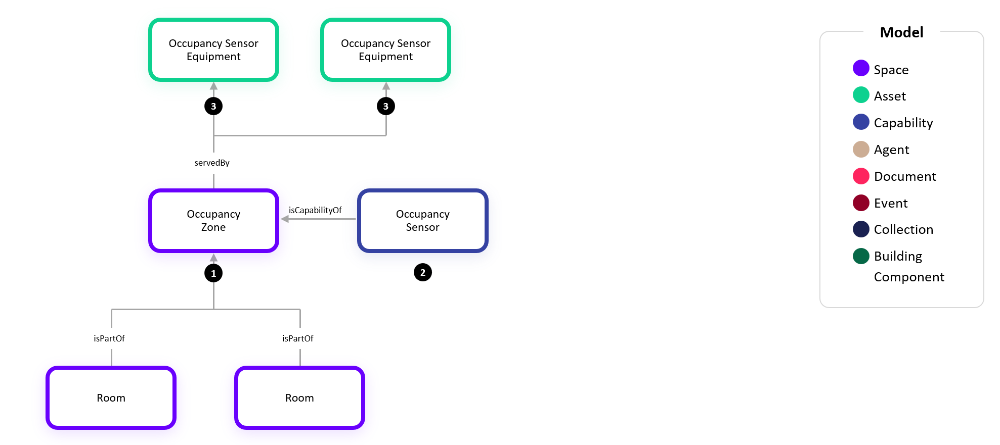
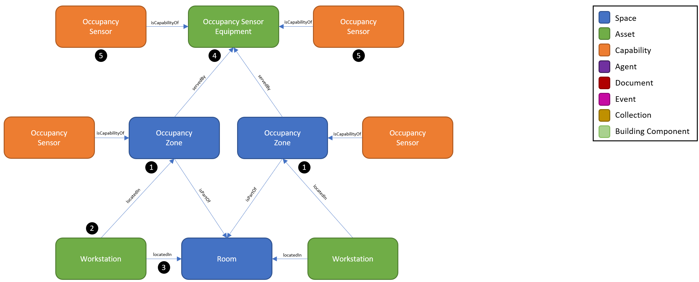

# Digital Twin Samples - Occupancy

Occupancy include scenarios where people (and objects) are tracked within a space. Use cases include understanding how space is used over time or triggering actions based on real-time events.

There are many different types of sensor technology and sources of data which can be deployed to achieve a desired outcome for a use case. Occupancy, presence, and motion sensors emit a Boolean true/false value to define the corresponding state of the space. People count sensors emit a number value to define the quantity of people either in a space or entering/leaving a space. Other sources of data which may not rely on dedicated sensors include access control system reader events, video analytics, Bluetooth/WiFi systems, and space reservation solutions.

## Occupancy Multi-Zone Room

1. At the core of every Occupancy use case is the Occupancy Zone. An Occupancy Zone is a type of Space which has a boundary, generally aligns 1:1 with a Room, but can also be more granular or broader. In this example, there are multiple Occupancy Zones within one Room. Because both Zones and Rooms are Spaces, we use the relationship isPartof.

2. Each Occupancy Zone has one or more Capabilities which are a unique trend for that space based on the type of data that the sensors or systems are providing. In this example, each Occupancy Zone has a People Count Sensor, but other common Capabilities are Occupancy Sensor, Motion Sensor, or Inferred Occupancy Sensor. Sometimes the telemetry for these Occupancy Zone Capabilities is sent by the connected system if they have a corresponding concept to the Occupancy Zone and have already aggregated or calculated the value based on the underlying sensor technology. Other times the Occupancy Zone Capabilities will need to be calculated by the WillowTwin because the connected sensors only expose their individual Capabilities (#4).

3. The People Count Sensor Equipment is the physical asset which is counting people. Generally, each equipment is aligned 1:1 with an Occupancy Zone, but there can also be multiple People Count Sensors serving a single zone as depicted in this example. Alternatively, there could be multiple Occupancy Zones served by a single People Count Sensor Equipment. The relationship servedBy is used between the People Count Sensor Equipment (Asset) and the Zone (Space).

4. Each People Count Sensor Equipment has one or more Capabilities which are emitted. In this example, the People Count Sensor Capability is defined but a single equipment may also emit other Capabilities such as Occupancy Sensor, Motion Sensor, or Inferred Occupancy Sensor.

5. When there are multiple People Count Sensors (#4) serving a single Occupancy Zone and the connection solution doesn’t calculate and emit the aggregate for the Zone, the Zone’s People Count Sensor Capability (#5) will need to be calculated by the WillowTwin by summing the values from the individual People Count Sensors (#4).

## Occupancy Multi-Room Zone

1. In this example, we show the flexibility in a zone where there are multiple Rooms within one Occupancy Zone. Because both Zones and Rooms are Spaces, we use the relationship isPartof.

2. The Occupancy Zone has an Occupancy Sensor Capability. Sometimes the telemetry for these Occupancy Zone Capabilities is sent by the connected system if they have a corresponding concept to the Occupancy Zone and have already aggregated or calculated the value based on the underlying sensor technology. Other times the Occupancy Zone Capabilities will need to be calculated by the WillowTwin because the connected sensors only expose their individual Capabilities (#4).

3. The Occupancy Sensor Equipment is the physical asset which is installed in the space. Generally, each equipment is aligned 1:1 with an Occupancy Zone, but there can also be multiple Occupancy Sensors serving a single zone as depicted in this example. The relationship servedBy is used between the Occupancy Sensor Equipment (Asset) and the Zone (Space).

4. In this example, each Occupancy Sensor Equipment has an Occupancy Sensor Capability.

5. When there are multiple Occupancy Sensors (#4) serving a single Occupancy Zone and the connection solution doesn’t calculate and emit the aggregate for the Zone, the Zone’s Occupancy Sensor Capability (#5) will need to be calculated by the WillowTwin by taking the logical OR of the values from the individual Occupancy Sensors (#4).

## Workstation Occupancy 

1. In this example, we again show the scenario where there are multiple Occupancy Zones within one Room. Because both Zones and Rooms are Spaces, we use the relationship isPartof.

2. Each Occupancy Zone is defined to align 1:1 with a Workstation. Therefore, we additionally establish the locatedIn relationship between the Workstation (Asset) and the Occupancy Zone (Space). While this is not explicitly required, it is recommended to enabled related scenarios where the Workstation is given an identity and assigned to or reserved by a Person.

3. Each Asset must have a locatedIn relationship to a Space to associate with the larger site such as the Building or Land (See Assets Example). In this example, the Workstation (Asset) is locatedIn a Room (Space).

4. In this example, we show the scenario where a multiple Occupancy Zones are served by a single Occupancy Sensor Equipment. This is common in camera-based solutions where a single equipment can be configured to track multiple logical zones.

5. When a single Occupancy Sensor Equipment is configured to track multiple logical zones, it has a unique Occupancy Sensor Capability twin (#5s) for each corresponding zone.
