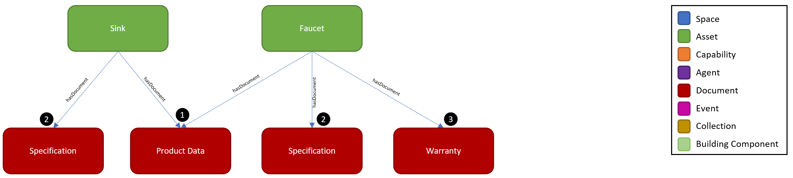
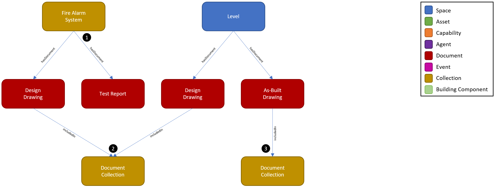

# Digital Twin Samples - Documents

Documents are one of the top-level DTDL models in the ontology. They provide a means of managing different types of physical or digital documents that relate to other twins such as Assets, Spaces, and Systems. The twin also provides a means of uploading the digital document. Use cases for Documents include uploading and managing design and construction artifacts such as drawings, specifications, submittals, and commissioning reports. Another use case is managing documents which have temporal metadata such as a warranty, lease, or contract.

## Asset Documents

1. There are many different types of documents which can be uploaded and managed by the twin. A Product Data PDF is commonly uploaded for Assets in a building and often available from construction management platforms. This provides the user quick access to find more details about an Asset that may not be captured in the Asset twin’s properties. In this example, we show that a Product Data document can be attached to multiple Assets such as a Sink and Faucet. Because buildings generally install multiple instances of the same type of asset, this enables the same document to be referenced by each of those asset twin instances using the hasDocument relationship from the Asset to the Document.

2. While each Asset may share a Product Data document, they can have other documents which are individually associated. In this example, the Sink and Faucet have different Specification documents.

3. In this example, the Faucet also has a Warranty document that is uploaded and managed by the twin.

## System/Space Documents & Document Collections

1. While Documents are commonly associated with Asset twins, they can also be associated with other twins. In this example, there is a Fire Alarm System which is a Collection. Because the system is commissioned as an entire entity instead of individual assets, we attach the Fire Alarm Test Report to the Fire Alarm System.

2. Documents can also be grouped together into Document Collections. In this example, we show that there are two Design Drawing documents that were created during the design process – a Fire Alarm System Design Drawing which may show a single-line diagram of the fire alarm system and a Level Design Drawing which may show the Fire Alarm floor plan for a specific Level in the building. The Document Collection groups these into a Fire Alarm Design Drawing package which may relate to a specific design phase deliverable such as 100% Construction Documents.

3. A Document Collection can flexibly group other documents such as As-Built Drawings. In this example, it shows that the same Level may have many different Documents across different Document Collections associated to it. This allows Documents to be searched and filtered by any number of their relationships to Collections, Spaces, and Assets.