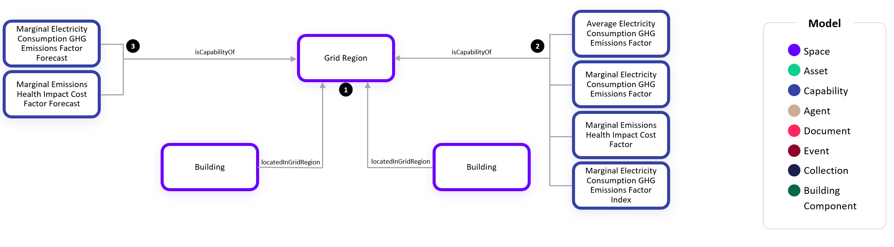

# Digital Twin Samples - Grid Emissions

## Grid Emissions

### Single-tier Grid Region

Signals from the electricity grid are important for load shifting, quantifying energy reduction impacts, and GHG accounting. In this example, we show how to assign buildings to a grid region:

1. A Grid Region has one or more Buildings that use the locatedInGridRegion relationship to specify which grid region they are placed. Other Spaces such as Outdoor Areas, Substructures, or Land could also be located in a Grid Region.

2. A Grid Region has several historical trends which are associated with it such as the Average Electricity Consumption GHG Emissions Factor, Marginal Electricity Consumption GHG Emissions Factor, Marginal Emissions Health Impact Cost, and Marginal Electricity Consumption GHG Emissions Factor Index.

3. A Grid Region also has forecast trends which are associated with it such as the Marginal Electricity Consumption GHG Emissions Factor Forecast and Marginal Emissions Health Impact Cost Forecast.

### Multi-tier Grid Regions

1. Some Grid Regions are further divided into sub-regions where there is more granularity for the trends related to marginal emissions. In these scenarios, the trends related to average emissions remain on the parent grid region and there is an isPartOf relationship between the two regions to indicate the hierarchy between the two like spaces.