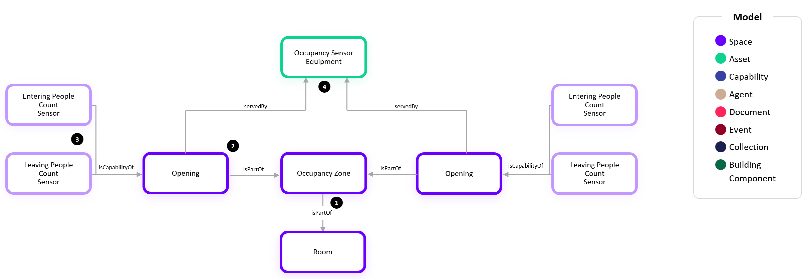
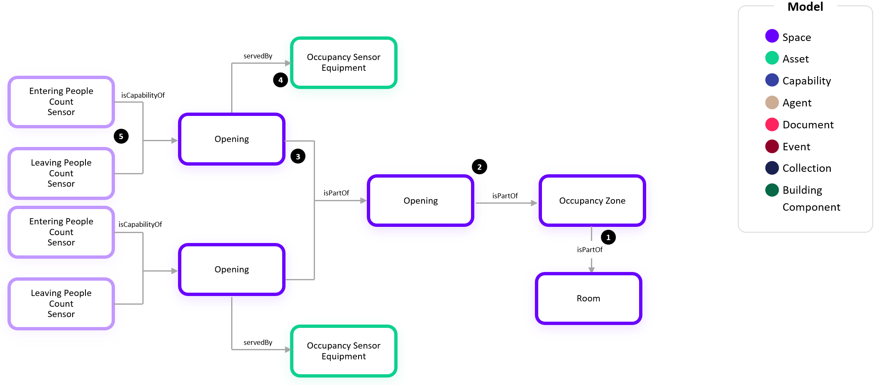
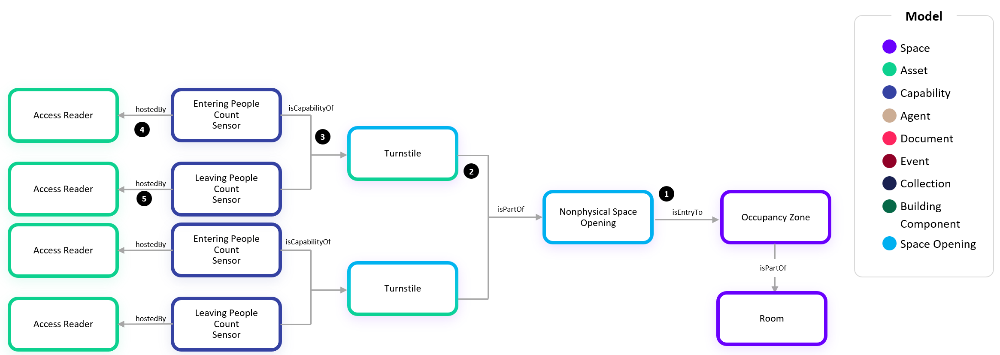
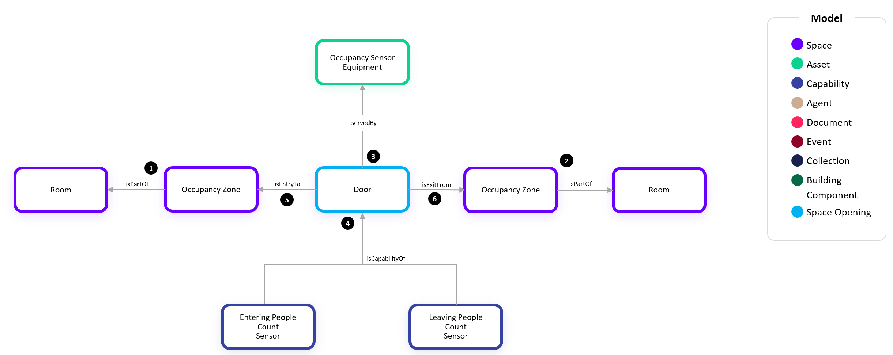
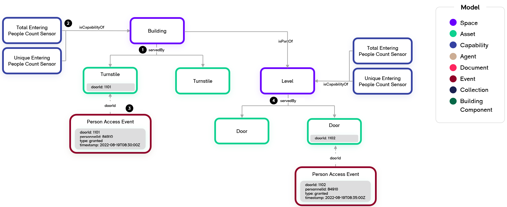

# Digital Twin Samples - Occupancy

Occupancy include scenarios where people (and objects) are tracked within a space. Use cases include understanding how space is used over time or triggering actions based on real-time events.

There are many different types of sensor technology and sources of data which can be deployed to achieve a desired outcome for a use case. Occupancy, presence, and motion sensors emit a Boolean true/false value to define the corresponding state of the space. People count sensors emit a number value to define the quantity of people either in a space or entering/leaving a space. Other sources of data which may not rely on dedicated sensors include access control system reader events, video analytics, Bluetooth/WiFi systems, and space reservation solutions.

## Space-based Occupancy and People Counts

Space-based sensors are typically located in the space for which they are determining the occupancy or people count. They directly report occupancy or people count values for a Space, such as a Room, of its current condition.

### Occupancy Multi-Zone Room

1. At the core of every Occupancy use case is the Occupancy Zone. An Occupancy Zone is a type of Space which has a boundary, generally aligns 1:1 with a Room, but can also be more granular or broader. In this example, there are multiple Occupancy Zones within one Room. Because both Zones and Rooms are Spaces, we use the relationship isPartof.

2. Each Occupancy Zone has one or more Capabilities which are a unique trend for that space based on the type of data that the sensors or systems are providing. In this example, each Occupancy Zone has a People Count Sensor, but other common Capabilities are Occupancy Sensor, Motion Sensor, or Inferred Occupancy Sensor. Sometimes the telemetry for these Occupancy Zone Capabilities is sent by the connected system if they have a corresponding concept to the Occupancy Zone and have already aggregated or calculated the value based on the underlying sensor technology. Other times the Occupancy Zone Capabilities will need to be calculated by the WillowTwin because the connected sensors only expose their individual Capabilities (#4).

3. The People Count Sensor Equipment is the physical asset which is counting people. Generally, each equipment is aligned 1:1 with an Occupancy Zone, but there can also be multiple People Count Sensors serving a single zone as depicted in this example. Alternatively, there could be multiple Occupancy Zones served by a single People Count Sensor Equipment. The relationship servedBy is used between the People Count Sensor Equipment (Asset) and the Zone (Space).

4. Each People Count Sensor Equipment has one or more Capabilities which are emitted. In this example, the People Count Sensor Capability is defined but a single equipment may also emit other Capabilities such as Occupancy Sensor, Motion Sensor, or Inferred Occupancy Sensor.

5. When there are multiple People Count Sensors (#4) serving a single Occupancy Zone and the connection solution doesn’t calculate and emit the aggregate for the Zone, the Zone’s People Count Sensor Capability (#5) will need to be calculated by the WillowTwin by summing the values from the individual People Count Sensors (#4).

### Occupancy Multi-Room Zone

1. In this example, we show the flexibility in a zone where there are multiple Rooms within one Occupancy Zone. Because both Zones and Rooms are Spaces, we use the relationship isPartof.

2. The Occupancy Zone has an Occupancy Sensor Capability. Sometimes the telemetry for these Occupancy Zone Capabilities is sent by the connected system if they have a corresponding concept to the Occupancy Zone and have already aggregated or calculated the value based on the underlying sensor technology. Other times the Occupancy Zone Capabilities will need to be calculated by the WillowTwin because the connected sensors only expose their individual Capabilities (#4).

3. The Occupancy Sensor Equipment is the physical asset which is installed in the space. Generally, each equipment is aligned 1:1 with an Occupancy Zone, but there can also be multiple Occupancy Sensors serving a single zone as depicted in this example. The relationship servedBy is used between the Occupancy Sensor Equipment (Asset) and the Zone (Space).

4. In this example, each Occupancy Sensor Equipment has an Occupancy Sensor Capability.

5. When there are multiple Occupancy Sensors (#4) serving a single Occupancy Zone and the connection solution doesn’t calculate and emit the aggregate for the Zone, the Zone’s Occupancy Sensor Capability (#5) will need to be calculated by the WillowTwin by taking the logical OR of the values from the individual Occupancy Sensors (#4).

### Workstation Occupancy 

1. In this example, we again show the scenario where there are multiple Occupancy Zones within one Room. Because both Zones and Rooms are Spaces, we use the relationship isPartof.

2. Each Occupancy Zone is defined to align 1:1 with a Workstation. Therefore, we additionally establish the locatedIn relationship between the Workstation (Asset) and the Occupancy Zone (Space). While this is not explicitly required, it is recommended to enabled related scenarios where the Workstation is given an identity and assigned to or reserved by a Person.

3. Each Asset must have a locatedIn relationship to a Space to associate with the larger site such as the Building or Land (See Assets Example). In this example, the Workstation (Asset) is locatedIn a Room (Space).

4. In this example, we show the scenario where a multiple Occupancy Zones are served by a single Occupancy Sensor Equipment. This is common in camera-based solutions where a single equipment can be configured to track multiple logical zones.

5. When a single Occupancy Sensor Equipment is configured to track multiple logical zones, it has a unique Occupancy Sensor Capability twin (#5s) for each corresponding zone.

## Entry and Exit-based People Counts

Entry and exit-based sensors are counting people crossing a threshold, such as an entryway, door, or turnstile. They differ from space-based people counts in that they can indicate how people are entering and leaving a space if there are multiple entryways, but they are less accurate in determining live counts. Because they are totalizing entries and exits, a missed person count entering or exiting a space propogates for the rest of the time period for which counts are being aggregated. As such, these typically need a daily reset.

### Simple Openings

This example depicts that an Occupancy Zone may be equipped with sensors that measure the flow of people in and out of the zone:

1. As with the previous examples, the Occupancy Zone is part of a Room.

2. The Occupancy Zone in this example contains two Space Openings, such as a corridor with two ends, which allow the passage of people that are being counted in and out of the zone. These openings could be physical barriers such as doors or access control turnstiles or nonphysical boundaries (Nonphysical Space Opening) defined by the sensor equipment. The specific type of Space Opening shown in this example is a Door which is both a Physical Space Opening and Asset in the ontology. 

3. An Opening always has a direction in which its two capabilities, Entering People Count Sensor and Leaving People Count Sensor, have the proper meaning for the flow of people in and out of the Occupancy Zone. When this is the case, we use the isEntryTo relationship from the Opening to the Occupancy Zone. See the Adjacent Zones, Shared Opening example for more explanation around when to use the other relationship, isExitFrom.

4. The Occupancy Sensor Equipment can measure the flow of people crossing one or more thresholds (Openings). Many sensor vendors call these openings “lines” with In/Out counts. We use the servedBy relationship to define the lines that are setup in the physical sensor equipment

### Divided Openings

This example depicts that an Occupancy Zone opening may be sub-divided into smaller openings:

1. As with the previous examples, the Occupancy Zone is part of a Room.

2. The Occupancy Zone has a single opening that may be too wide to measure with a single physical sensor.

3. The single opening is sub-divided into two smaller openings that may or may not be physically separated.

4. Each of the smaller openings are served by a separate Occupancy Sensor Equipment.

5. Each of the smaller openings also has its own Entering People Count Sensor and Leaving People Count Sensor.

### Divided Openings (Card Access Readers)

This example depicts a divided opening which has multiple turnstiles each with an entry and exit card access reader (aka badge in, badge out) to access a space such as an elevator lobby:

1. As with the previous examples, the Nonphysical Space Opening has an isEntryTo relationship to the Occupancy Zone which represents the elevator lobby. We use Nonphysical Space Opening because the opening itself to the elevator lobby is nonphysical even though the turnstiles individually are physical space openings.

NOTE: Due to how the ontology is configured with Doors and Turnstiles being both Assets and Physical Openings, twins cannot use dtmi:com:willowinc:SpaceOpening;1, dtmi:com:willowinc:PhysicalOpening;1 as the model. These shoudl be considered abstract models and either Door, Turnstile, or Nonphysical Opening should be used.

2. In this example, we have two physical space opening assets which are Turnstiles. Turnstiles are both Assets and Space Openings in the ontology.

3. Each turnstile has an entry card access reader and exit card access reader. As such there are two capabilities, Entering People Count Sensor and Leaving People Count Sensor. These are the total number of person granted access events for entering and leaving through the turnstile.

4. Each Access Reader on the turnstile is designated as the entry (IN) or exit (OUT). Because the isCapabilityOf relationship is already defining the count relative to the parent Turnstile, the hostedBy relationship from the Entering People Count is used to define which reader is used for entry.

5. Similarly, the Access Reader which enables exit is hosting the Leaving People Count Sensor

### Adjacent Zones, Shared Opening

Often when using the entry and exit-based people count sensors, the count of people entering one zone from an opening equates to the same count of people leaving its adjacent zone. This example depicts how to model this scenario:

1. We start with defining an Occupancy Zone as part of a Room. Let’s say this Room #1 is a Lobby.

2. Next, we have another Occupancy Zone that is part of a Room #2 which is adjacent to Room #1.

3. Room #1 and Room #2 share an Opening (i.e. door). This Opening is served by the Occupancy Sensor Equipment which is counting the people coming in and out of the opening.

4. The Opening has two Capabilities, Entering People Count Sensor and Leaving People Count Sensor.

5. Now, we need to define the Entry and Exit relationships for the opening such that its two capabilities can have proper context for Entering and Leaving. The Opening has the relationship isEntryTo to the OccupancyZone for which the Entering People Count defines the people entering that zone. Likewise, the Leaving People Count defines the people leaving from the zone for which the Opening is an entry for. In our example, this means that the Entering People Count and Leaving People Count define the people entering and leaving from Room #1.

6. Next, we define the relationship isExitFor to the OccupancyZone for which the Opening’s two capabilities have the opposite meaning. In other words, we can infer that the numbering of people leaving Room #2 via this Opening is the Entering People Count Sensor. Likewise, the number of people entering Room #2 via this Opening can be inferred from the Leaving People Count Sensor.

### Access Control People Counts

In this example, we show how person access events (i.e. access reader granting access) can be used by the WillowTwin to determine occupancy metrics for the Building or a Level.

1. We establish the Building servedBy relationship with the Turnstile to specify which person access granted events should be summed to calculate the Building’s Total and Unique Entering People Counts.

2. The Total Entering People Count Sensor and Unique Entering People Count Sensor are calculated by the WillowTwin based on the Person Access Events associated with the Building. The Total Entering People Count is defined as the sum of all access reader granted events for the defined period regardless of whether the same person has entered multiple times whereas the Unique Entering People Count is defined as the unique individuals who have entered for the defined period which will not increment if the same person enters multiple times.

3. While the Person Access Event is shown as if it were a twin in this image, it is NOT required to be created as an actual twin in the WillowTwin at this time. This Person Access Event is showing a record in the time series database and how it relates to the Turnstile which is required for the WillowTwin to calculate the Total and Unique Entering People Counts.

4.  If we want to determine another space’s entering people count, we use the same servedBy relationship from the space. In this example we show a Level which has two Doors as its entry points. Note that in a multi-tenant building, it is common to have doors at the ends of the elevator lobby, but these are often access controlled by the tenant’s access control system rather than the building’s access control system. As such, it may not be possible to determine floor level occupancy purely from a connection to the building’s access control system.
