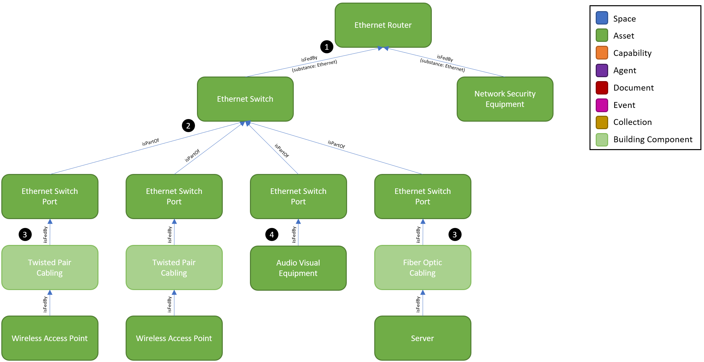

# Digital Twin Samples - Data Network

Data Network includes scenarios where network topologies and equipment can be managed and analyzed in the digital twin. Use cases include understanding impacts on downstream equipment when servicing network equipment, bandwidth management and planning,, and digitizing Ethernet/IP addressing assignments.

## Data Network Topology

Data Networks have common equipment found various sites but vary widely in terms of how many tiers of distribution are involved from a service provider router. Also, the physical media and speeds can vary widely depending on the equipment specifications. While the configurations are limitless, this example shows a common scenario found within most sites.

1. The Ethernet Router is considered as the starting point for a data network as it is the demarcation between a service provider’s network and the local area network (LAN). In this example, the Ethernet Router feeds an Ethernet Switch and a Network Security Equipment (i.e. Firewall). The isFedBy relationships defines the substance as Ethernet to specify that the relationship between these two equipment that they transmit Ethernet data.

2. The Ethernet Switch is the most common piece of data network equipment. A typical configuration for an Ethernet Switch is 24 or 48 Switch Ports. When it is known which Ethernet Ports are connected to which downstream devices, we create twins for each Ethernet Port to enable this mapping. This is analogous to assigning Electrical Circuits to Equipment in the Electrical example. In this example, we show just four of the Ethernet Switch Ports that are on the Ethernet Switch. The isPartOf relationship is used because these ports are integral to the switch.

3. In some instances where a high-fidelity twin is being created, the physical cabling media can be given identity. While this is rare, it is possible to define the Twisted Pair Cabling or Fiber Optic Cabling. This may be advantageous when it is desired to track the structured cabling specifications and cable run lengths.

4. A more common scenario is directly assigning an equipment with an Ethernet Network Interface Card (NIC) to the switch port that it's connected to. In this example, we show an Audio Visual Equipment connected to a switch port. For purposes of brevity in the diagram, we aren’t showing the isFedBy substance: Ethernet; however, it is always recommended to include this detail in the isFedBy relationships.
