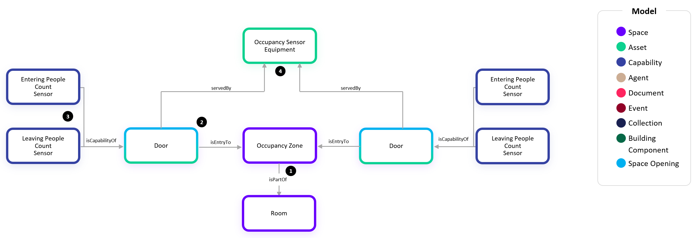
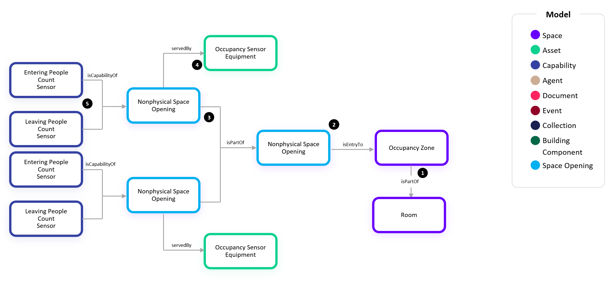
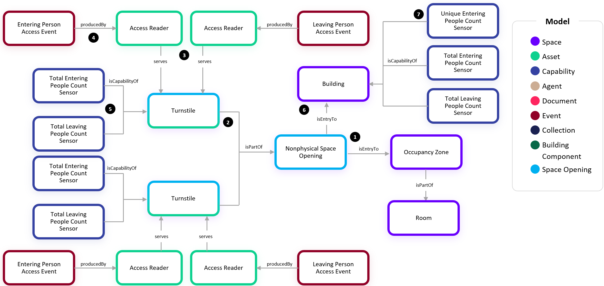
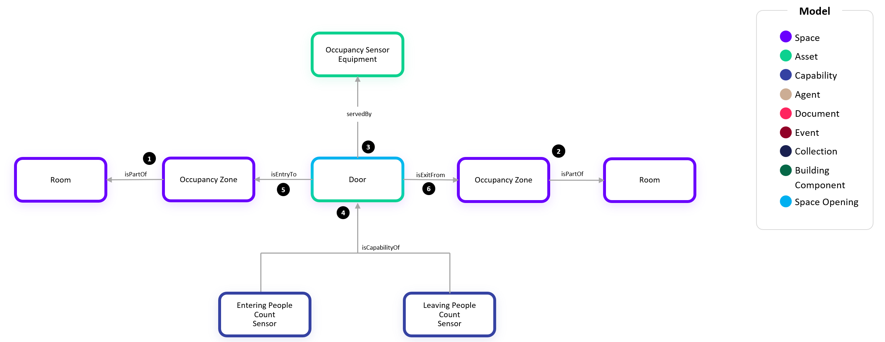

# Digital Twin Samples - Occupancy

Occupancy include scenarios where people (and objects) are tracked within a space. Use cases include understanding how space is used over time or triggering actions based on real-time events.

There are many different types of sensor technology and sources of data which can be deployed to achieve a desired outcome for a use case. Occupancy, presence, and motion sensors emit a Boolean true/false value to define the corresponding state of the space. People count sensors emit a number value to define the quantity of people either in a space or entering/leaving a space. Other sources of data which may not rely on dedicated sensors include access control system reader events, video analytics, Bluetooth/WiFi systems, and space reservation solutions.

## Space Occupancy and People Counts

Space-based sensors are typically located in the space for which they are determining the occupancy or people count. They directly report occupancy or people count values for a Space, such as a Room, of its current condition.

There are two styles of reporting space occupancy that a sensor solution may offer: device-based and zone-based. Let's take a look at how to configure each:

### Device-based Space Occupancy

The device-based space occupancy configuration is when the telemetry being sent from the sensor vendor is related to a sensor device (People Count Sensor Equipment or Occupancy Sensor Equipment). In this scenario, we configure the following sets of twins and relationships:

1. Each device is either a People Count Sensor Equipment or Occupancy Sensor Equipment depending on whether it is measuring the count of people in the space (People Count Sensor) or boolean occupancy (Occupancy Sensor). In this example we show a People Count Sensor Equipment each with its associated People Count Sensor capability.

2. Typically each Sensor Equipment will define the occupancy for a single space so there is a 1:1 relationship between an Occupancy Zone and a Sensor Equipment using the servedBy relationship. In some cases, multiple devices are deployed in a single space which need to be summed to determine the space's total people count at a given point in time. These Occupancy Zones would then have a servedBy relationship to each Sensor Equipment. When these are Occupancy Sensors, a logical OR expression can be used to determine overall space occupancy as a boolean.

3. Each Occupancy Zone has an isPartOf relationship to the Room in which it is associated. The Room comes from another system such as a Space Management solution. It is important to note that the occupancy solution does not define Room twins even when their APIs or terminology refers to Rooms. Instead, they form relationships to these as defined in the other solution. The occupancy solution always contributes Sensor capabilties, Sensor Equipment, and Occupancy Zones.

### Space-based Space Occupancy

The space-based space occupancy configuration is when the telemetry (People Count Sensor or Occupancy Sensor) being sent from the sensor vendor is related to a space. Many sensor vendors may offer both device-based an space-based in their reporting. In this case, the space-based telemetry is always preferred as the vendor has already performed the aggregation and in many cases has unique functionality in doing so to assure better accuracy.

1. Each Occupancy Zone has either a People Count Sensor or Occupancy Sensor depending on whether it is measuring the count of people in the space (People Count Sensor) or boolean occupancy (Occupancy Sensor). In this example we show a People Count Sensor Equipment each with its associated People Count Sensor capability.

2. Similar to the device-based example above, each Occupancy Zone has an isPartOf relationship to the Room in which it is associated. The Room comes from another system such as a Space Management solution. It is important to note that the occupancy solution does not define Room twins even when their APIs or terminology refers to Rooms. Instead, they form relationships to these as defined in the other solution. The occupancy solution always contributes Sensor capabilties, Sensor Equipment, and Occupancy Zones.

3. Optionally, the space-based solutions may still provide details about which physical sensor devices are serving the spaces. In this scnario, we include the Occupancy Zone servedby Sensor Equipment relationship just as the device-based example above. These may still have other capabilities such as the Battery Level State or be used in an asset management solution.

### Workspace Occupancy 

When individual workspaces or workstations are being sensed for occupancy rather than rooms, we include those in the Space Occupancy dashboard but use a slightly different set of models. In this scenario, we use the boolean Occupancy Sensor capability to create a count of 1 person occupying the workspace. 

1. Similar to the standard device-based example above, an Occupancy Sensor Equipment has an Occupancy Sensor capability which determines whether someone is currently occupying the workspace.

2. Again, each Occupancy Zone will have a 1:1 servedBy relationship to an Occupancy Sensor Equipment.

3. The Occupancy Zone has an isPartOf relationship to a Workspace in this example which in turn isPartOf a Room or Level depending on the configuration in the Space Management system. Again, this will typically be 1:1 when the Workspace is aligned to an individual's workstation but there could be scenarios where a multi-person Workspace in the space management solution has individual seats being measured in which case there would be multiple Occupancy Zones for a single Workspace.

### Occupancy Multi-Room Zone

1. In each of the above examples, the Occupancy Zone had either a 1:1 or Many:1 relationship to a Room. In this example, we show the flexibility in a zone where there are multiple Rooms within one Occupancy Zone. This may be the case where the Space Management solution has defined separate "rooms" for an open office area or a large gathering area yet the occupancy solution has defined it as a single large entity.

2. The Occupancy Zone has an Occupancy Sensor capability just as the space-based example above. This could also be a People Count Sensor. This could also be a device-based setup where the Occupancy Sensor capability would exist on the Occupancy Sensor Equipment rather than the zone.

3. The Occupancy Sensor Equipment (or People Count Sensor Equipment) has the servedBy relationship from the Occupancy Zone.

### Assigning Occupancy Zones to Rooms or Levels

While the above examples all showed the Occupancy Zones as a part of a Room (or Workspace), it is also possible that level of detail isn't available in the occupancy solution and the Occupancy Zones are just known to be on a specific level of a building. In these scenarios, we directly associate the Occupancy Zone to a Level as shown here:

## Entry and Exit-based People Counts (Footfall)

Entry and exit-based sensors are counting people crossing a threshold, such as an entryway, door, or turnstile. This is also referred to as footfall. They differ from space-based people counts in that they can indicate how people are entering and leaving a space if there are multiple entryways, but they are less accurate in determining live counts. Because they are totalizing entries and exits, a missed person count entering or exiting a space propogates for the rest of the time period for which counts are being aggregated. As such, these typically need a daily reset.

### Simple Openings

This example depicts that an Occupancy Zone may be equipped with sensors that measure the flow of people in and out of the zone:

1. As with the previous examples, the Occupancy Zone is part of a Room.

2. The Occupancy Zone in this example contains two Space Openings, such as a corridor with two ends, which allow the passage of people that are being counted in and out of the zone. These openings could be physical barriers such as doors or access control turnstiles or nonphysical boundaries (Nonphysical Space Opening) defined by the sensor equipment. The specific type of Space Opening shown in this example is a Door which is both a Physical Space Opening and Asset in the ontology. 

3. An Opening always has a direction in which its two capabilities, Entering People Count Sensor and Leaving People Count Sensor, have the proper meaning for the flow of people in and out of the Occupancy Zone. When this is the case, we use the isEntryTo relationship from the Opening to the Occupancy Zone. See the Adjacent Zones, Shared Opening example for more explanation around when to use the other relationship, isExitFrom.

4. The Occupancy Sensor Equipment can measure the flow of people crossing one or more thresholds (Openings). Many sensor vendors call these openings “lines” with In/Out counts. We use the servedBy relationship to define the lines that are setup in the physical sensor equipment

### Divided Openings

This example depicts that an Occupancy Zone opening may be sub-divided into smaller openings:

1. As with the previous examples, the Occupancy Zone is part of a Room.

2. The Occupancy Zone has a single opening that may be too wide to measure with a single physical sensor.

3. The single opening is sub-divided into two smaller openings that may or may not be physically separated.

4. Each of the smaller openings are served by a separate Occupancy Sensor Equipment.

5. Each of the smaller openings also has its own Entering People Count Sensor and Leaving People Count Sensor.

### Divided Openings (Card Access Readers)

This example depicts a divided opening which has multiple turnstiles each with an entry and exit card access reader (aka badge in, badge out) to access a space such as an elevator lobby:

1. As with the previous examples, the Physical Space Opening has an isEntryTo relationship to the Occupancy Zone which represents the elevator lobby.

2. In this example, we have two physical space opening assets which are Turnstiles. Turnstiles are both Assets and Space Openings in the ontology.

3. Each turnstile has an entry card access reader and exit card access reader with a serves relationship to the Turnstile.

4. Each Access Reader on the turnstile is designated as enabling entry (IN) or exit (OUT). This is captured by creating an Entering Person Access Event (IN) or Leaving Person Access Event (OUT) with a producedBy relationship to the Access Reader. These Person Access Events are sent to Willow from an Access Control connector and also include additional metadata such as the personnel ID that badged and whether they were granted or denied access.

5. Each Turnstile has a Total Entering People Count Sensor and Total Leaving People Count Sensor. These are calculated values by Willow which query the Entering/Leaving Person Access Events for the day. These are totalized throughout a day and reset at midnight.

6. Each of the perimeter Openings to a Building get an isEntryTo relationship to the Building which enables the Total Entering People Count and Total Leaving People Count from those Openings to be summed for the Building’s Total Entering People Count and Total Leaving People Count.

7. The Unique Entering People Count Sensor is a calculated value by Willow which queries all granted events across all Access Readers at the Building.

### Adjacent Zones, Shared Opening

Often when using the entry and exit-based people count sensors, the count of people entering one zone from an opening equates to the same count of people leaving its adjacent zone. This example depicts how to model this scenario:

1. We start with defining an Occupancy Zone as part of a Room. Let’s say this Room #1 is a Lobby.

2. Next, we have another Occupancy Zone that is part of a Room #2 which is adjacent to Room #1.

3. Room #1 and Room #2 share an Opening (i.e. door). This Opening is served by the Occupancy Sensor Equipment which is counting the people coming in and out of the opening.

4. The Opening has two Capabilities, Entering People Count Sensor and Leaving People Count Sensor.

5. Now, we need to define the Entry and Exit relationships for the opening such that its two capabilities can have proper context for Entering and Leaving. The Opening has the relationship isEntryTo to the OccupancyZone for which the Entering People Count defines the people entering that zone. Likewise, the Leaving People Count defines the people leaving from the zone for which the Opening is an entry for. In our example, this means that the Entering People Count and Leaving People Count define the people entering and leaving from Room #1.

6. Next, we define the relationship isExitFor to the OccupancyZone for which the Opening’s two capabilities have the opposite meaning. In other words, we can infer that the numbering of people leaving Room #2 via this Opening is the Entering People Count Sensor. Likewise, the number of people entering Room #2 via this Opening can be inferred from the Leaving People Count Sensor.

### Building Footfall

Building Footfall differs from Space Footfall in that the footfall is related to entire building occupancy as determined by measuring the people entering and leaving the entrances to the building. This is a more accurant means of determining the building occupancy because space occupancy rarely has the ability to provide pervasive enough sensors throughout the building.

This building footfall data could be sourced from either an IoT sensor device which measures the quantitiy and direction of people crossing a line or an access control system where badge swipe events provide the quantity and direction of people entering and leaving the building. Here are examples showing these two scenarios:

#### People Count Sensor-based Footfall (Simple Openings)

1. The modeling of an Opening (i.e. Door) and its Entering/Leaving People Count Sensors is the same as shown above for individual space footfall.

2. Similarly, the Door is servedBy the People Count Sensor Equipment.

3. For Building Footfall, the Openings (i.e. Doors) which need to be summed to determine the total have an isEntryTo relationship to the Building.

4. A pair of calculated capabilities, Total Entering/Leaving People Count Sensors, are added to the Building. While these are not often determined or provided by the sensor vendor, Willow sets these up to use in analytics.

#### Access Control-based Footfall (Simple Openings)

1. Each Access Reader has a producedby relationship to either an Entering or Leaving Person Access Event based on whether the reader is providing entry or exit to the building.

2. When there is both an entry and exit access reader on the same Door, they each have a serves relationship to the Door.

3. Each Opening (i.e. Door or Turnstile) which needs to be summed to determine the total has an isEntryTo relationship to the Building.

4. The Door gets a pair of calculated capabilities, Total Entering/Leaving People Count Sensors, which are used to provide a breakdown of which Openings are used most and least. While these are not often determined or provided by the sensor vendor, Willow sets these up to use in analytics.

5. Similar to the above People Count Sensor example, a pair of calculated capabilities, Total Entering/Leaving People Count Sensors, are added to the Building. While these are not often determined or provided by the sensor vendor, Willow sets these up to use in analytics. For Access Control-based Footfall, a third calculated capability which is the Unique Entering People Count Sensor is added because Access Control Systems provide in the metadata of their Person Access Event payloads the details about which person has swiped the badge and thus daily unique counts are offered.