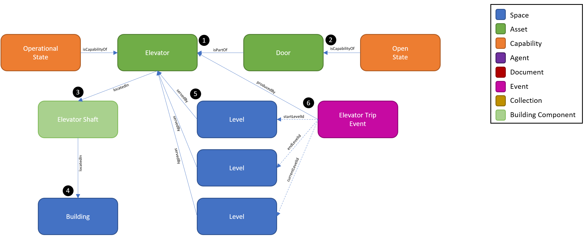

# Digital Twin Samples - Elevator

Elevators are a common form of conveyance assets which also include escalators and moving walkways. Conveyance assets are critical to the occupant experience of efficiently transporting people and freight vertically between levels or horizontally in the case of moving walkways. Modern elevators produce a great amount of telemetry that can be ingested by the digital twin. Additionally, they are able to be called by 3rd party systems such as a mobile app and digital twin.

Use cases for elevators include predictive maintenance, automated service requests, and status notifications.

## Elevator Monitoring

1. The Elevator asset is a twin that represents the elevator cab which travels vertically within an elevator shaft. In this example, we show that the elevator cab also has a single Door which uses the isPartOf relationship with the Elevator.

2. While the door is considered integral to the elevator cab and doesn’t require its own twin to be created, we show that the Door has its own Capability, Open State being reported by the Elevator system. In these scenarios where an asset has a part or component with Capabilities, it is recommended to create a twin of that component. This enables the digital twin to more flexibly model different Elevator configurations and reduces the need to overload the Capabilities with metadata to differentiate between them.

3. Because the Elevator is a vertically moving asset, the locatedIn relationship cannot be applied to a single Room or Level as we typically show for static assets. Instead, the Elevator’s vertical location is constantly changing. As such, we say the Elevator is locatedIn an Elevator Shaft Building Component which is a vertical space that spans multiple Levels. In some Buildings, multiple Elevators may share the same Elevator Shaft which is easily modeled using this same relationship.

4. The Elevator Shaft is locatedIn a Building. While recommended, it is not required to always model the Elevator Shaft as its own twin. Instead, we could have alternatively directly used the locatedIn relationship between the Elevator and the Building.

5. The Elevator is configured with at least two landings, or Levels, at which it stops. The servedBy relationship is used to define which Levels the Elevator cab is configured to stop. In this example, we show three Levels that the Elevator is servedBy.

6. An Elevator Trip Event is a common piece of data producedBy an Elevator. It can include the starting Level, ending Level, and current Level as well as timestamps to define its travel time. In this example, we show that the Elevator Trip Event uses the Properties startLevelId, endLevelId, and currentLevelId instead of relationships. The use of Properties to represent a relationship is denoted in the diagram using a dashed line. Because the trips produced by the elevator are constantly changing these relationships, we don’t require the digital twin to keeps track of these natively by constantly deleting and creating these relationships to the different Level twins. Instead, we allow the payload that the Elevator sends to include these Level Ids to be trended.