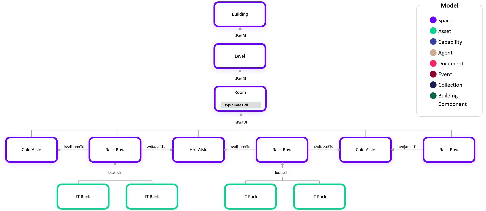
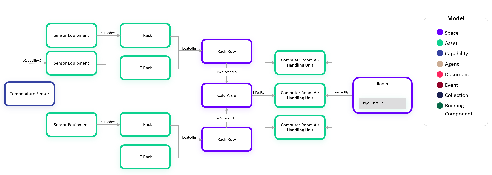
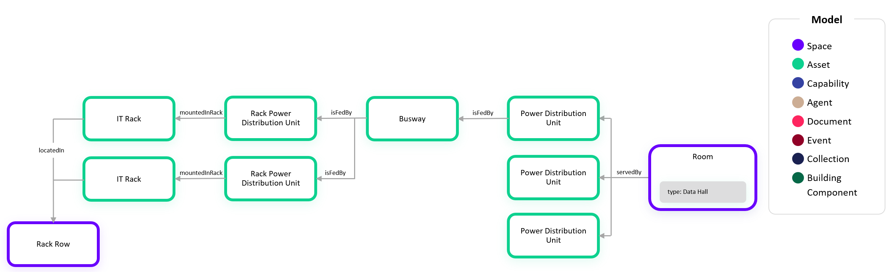

# Digital Twin Samples - Data Centers

Data centers introduce a unique set of use cases across space, assets, and monitoring.

## Basic Hierarchy

In this example, we show the basic space heirachy including rack rows, hot and cold aisles, concluding with locating the rack.

## Modeling HVAC in the Data Hall

## Modeling Electrical in the Data Hall

